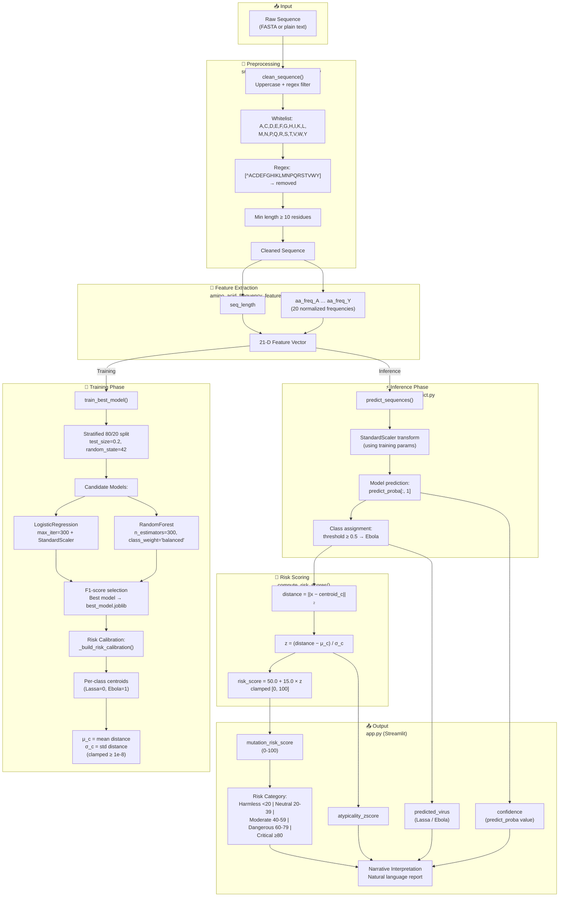

# Classification and Risk Scoring Pipeline Flowchart



## Pipeline Summary

| Stage | File | Key Function | Output |
|-------|------|-------------|--------|
| Preprocessing | `src/features/sequence_features.py` | `clean_sequence()` | Cleaned AA sequence |
| Feature Extraction | `src/features/sequence_features.py` | `amino_acid_frequency_features()` | 21-D vector |
| Training | `src/models/train.py` | `train_best_model()` | `best_model.joblib` |
| Risk Calibration | `src/models/train.py` | `_build_risk_calibration()` | Centroids + μ_c, σ_c |
| Inference | `src/models/predict.py` | `predict_sequences()` | Predictions + risk scores |
| Deployment | `app.py` | Streamlit UI | Interactive web app |

## Risk Score Formula

```
distance = ||x − centroid_c||₂
z = (distance − μ_c) / σ_c
risk_score = clamp(50.0 + 15.0 × z, 0.0, 100.0)
```

## Category Thresholds

| Category | Threshold |
|----------|-----------|
| Harmless | < 20 |
| Neutral | 20 – 39 |
| Moderate | 40 – 59 |
| Dangerous | 60 – 79 |
| Critical | ≥ 80 |
