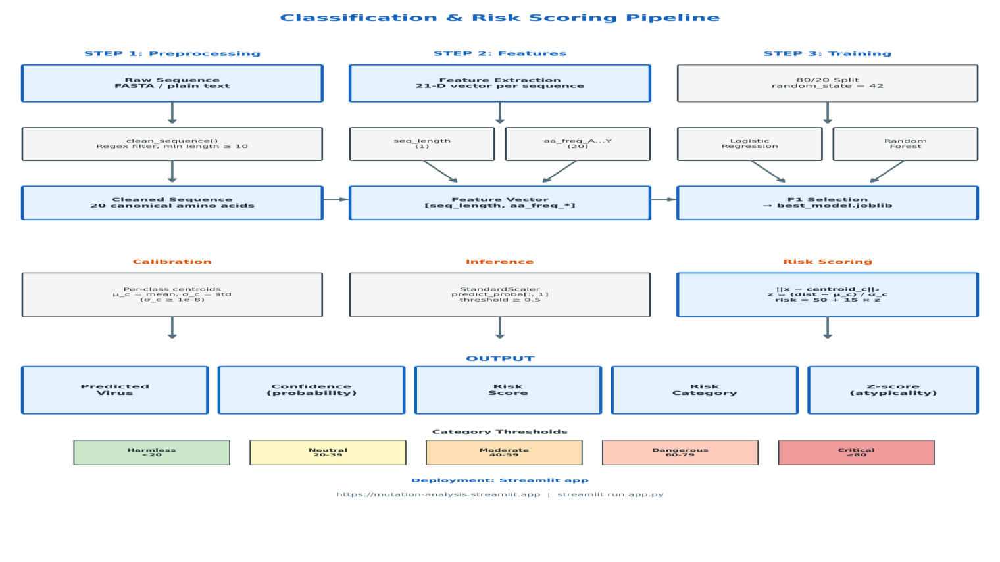
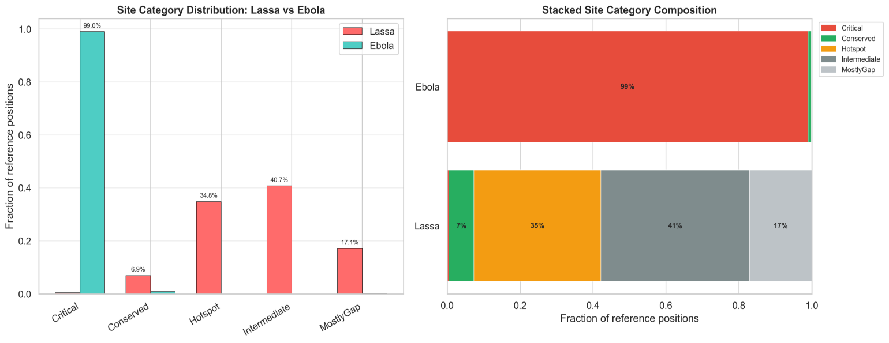
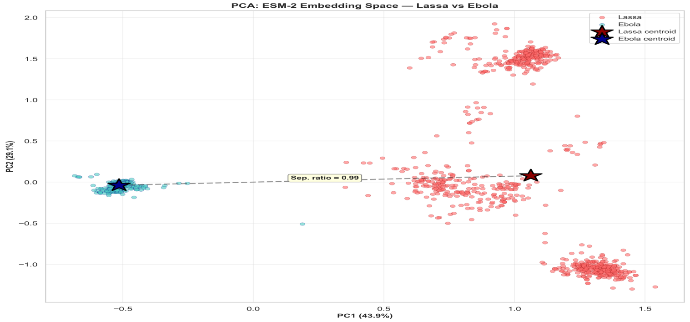
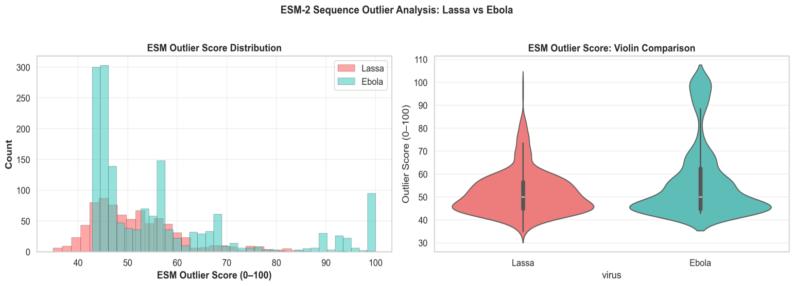

***ESM-embedR: A Protein Language Model Framework for Comparative Mutation Analysis and Computational Atypicality Scoring of Lassa and Ebola Virus Sequences***

Olatunji M. Kolawole1,2, Damilola M. Olayemi1, Damilare I. Taiwo1, Caroline F. Kolawole1, George E. Ejembi1

1Infectious Disease and Environmental Health Research Group, Department of Microbiology, Faculty of Life Sciences, University of Ilorin, Ilorin, Nigeria.

2Warwick Medical School, Directorate of Applied Health, University of Warwick, CV4 7AL, United Kingdom.

**Corresponding authors:**  
Olatunji M. Kolawole <(Olatunji.Kolawole@warwick.ac.uk>; <omk@unilorin.edu.ng>)

## Abstracts

The emergence and re-emergence of viral pathogens with pandemic potential necessitate robust computational frameworks capable of interpreting sequence variation in evolutionary and functional contexts. Lassa virus (LASV) and Ebola virus (EBOV), two members of the Arenaviridae and Filoviridae families, respectively, represent contrasting evolutionary paradigms: LASV exhibits substantial genetic diversity across West Africa, while EBOV outbreaks have historically been characterised by more constrained genetic variation. Understanding the differential mutational constraints governing these viruses provides critical insights for surveillance, vaccine design, and therapeutic development. This study presents a comprehensive, end-to-end computational framework bridging comparative virology and practical deployment. Analysis encompassed 2,390 curated protein sequences (780 LASV, 1,610 EBOV) derived from established genomic repositories. The pipeline integrated site-level constraint categorisation via conservation and entropy analysis, substitution burden quantification, protein-language model embedding characterisation using ESM-2, and supervised machine learning classification with interpretable computational atypicality scoring. The comparative analysis revealed profound asymmetries in mutational architecture. EBOV exhibited near-complete positional constraint with 98.96% of analysed sites classified as Critical, and only 1.99% realized substitution burden, while LASV displayed substantial flexibility with 34.83% Hotspots, 40.73% Intermediate sites, and 42.04% substitution burden. ESM-2 embedding analysis corroborated these findings (separation ratio 0.994), with EBOV showing 199 high-outlier sequences versus 13 for LASV. A logistic regression classifier achieving perfect held-out performance (accuracy, precision, recall, F1, ROC-AUC all 1.000) was selected for deployment over a random forest due to equivalent performance with reduced operational complexity. This model was integrated with an interpretable atypicality layer generating a computational atypicality index with bounded interpretive bands, atypicality z-scores, and natural language interpretations, deployed via a public Streamlit application. This represents one of the first openly accessible frameworks combining cross-virus mutational landscape quantification with real-time narrative inference in a single reproducible pipeline.

**Keywords**: *Lassa virus, Ebola virus, Comparative virology, Mutation landscape, Protein language models, ESM embeddings*

**Introduction**

Viral hemorrhagic fevers caused by Lassa virus (LASV) and Ebola virus (EBOV) continue to pose significant public health threats across sub-Saharan Africa. LASV, the causative agent of Lassa fever, is endemic in West Africa with an estimated 100,000–300,000 annual infections and 5,000 deaths, while EBOV has caused multiple outbreaks with case fatality rates ranging from 25% to 90% \[1\]. Lassa virus (LASV), a member of the Arenaviridae family, is endemic in several West African countries, including Nigeria, Sierra Leone, Liberia, and Guinea. Meanwhile, Ebola virus (EBOV), belonging to the Filoviridae family, has been responsible for periodic outbreaks primarily in Central and West Africa. Despite their distinct ecological niches, LASV maintained in multimammate rats (Mastomys natalensis) with sporadic human spillover, and EBOV, with more episodic zoonotic emergence, both viruses share the challenge of genetic surveillance to track evolutionary trajectories, identify concerning mutations, and inform intervention strategies. The computational characterization of viral protein sequences has undergone substantial transformation with the advent of protein language models (PLMs) and large-scale sequence analysis frameworks. Traditional approaches relying on multiple sequence alignment and position-specific scoring have been complemented by deep learning methods that can capture complex evolutionary and structural signals directly from sequence data \[2,3,4\]. The ESM (Evolutionary Scale Modelling) family of models, developed by Meta AI, has demonstrated particular utility for predicting protein structure, mutation fitness effects, and evolutionary relationships without requiring explicit structural information \[3,5\].

Many studies generate valuable comparative insights but remain confined to static figures and tables in academic publications, inaccessible to frontline researchers and public health officials who require rapid sequence interpretation. This translational disconnect limits the real-world impact of computational virology research, particularly in resource-limited settings where sophisticated bioinformatics expertise may be unavailable. LASV and EBOV exhibit markedly different evolutionary patterns that reflect their distinct transmission dynamics and host interactions. LASV demonstrates substantial genetic diversity across its endemic range, with multiple lineages (I–VII) circulating in Nigeria, Sierra Leone, Liberia, Guinea, and Mali \[1,6\]. This diversity is maintained through continuous enzootic circulation and frequent human spillover events, creating opportunities for sustained evolutionary exploration of sequence space. However, EBOV outbreaks, while devastating, have historically been more genetically constrained \[44\]. The 2013–2016 West African epidemic, caused by the Makona variant, involved extensive human-to-human transmission but surprisingly limited genetic diversification given the scale of the outbreak \[7,8,43\]. Analysis of the Makona 1610 genomes dataset revealed that despite thousands of transmission chains, the virus maintained remarkable genetic stability, with most mutations representing transient polymorphisms rather than sustained lineage-defining changes \[7\].

The re-emergence and recurrent outbreaks of viral haemorrhagic fevers in most sub-Saharan African countries, including Nigeria, have led to substantial biosecurity, public health, and socio-economic challenges \[9,10,11,41\]. Meanwhile, pathogens such as Lassa and Ebola viruses are among the most consequential, having recently led to recurrent outbreaks \[12,13\]. The 2014–2016 West African epidemic, primarily affecting Guinea, Liberia, and Sierra Leone, resulted in over 11,000 deaths and highlighted the vulnerability of regional health systems \[14\]. Both viruses are zoonotic RNA viruses, and their persistence in animal reservoirs, combined with human mobility and ecological disruption, sustains the risk of future outbreaks \[10,11\]. EBOV and LASV, at the molecular level, possess single-stranded RNA genomes but differ in their replication strategies and genomic architectures \[15\]. LASV has a bi-segmented ambisense RNA genome composed of the small (S) and large (L) segments, encoding structural proteins such as the glycoprotein complex and nucleoprotein, as well as the RNA-dependent RNA polymerase \[6,16,17\]. Meanwhile, EBOV has a non-segmented, negative-sense RNA genome of approximately 19 kb encoding seven structural proteins, including the glycoprotein, nucleoprotein, VP40, VP24, VP35, VP30, and the polymerase \[18,19,35\]. Viruses share an important biological feature, common to RNA viruses, despite their structural differences: high mutation rates driven by the error-prone nature of RNA-dependent RNA polymerases. However, the absence of proofreading mechanisms leads to rapid genetic diversification, enabling viral adaptation to therapeutic interventions, host immune pressure, and environmental changes \[18,6,16\].

Although selective pressure shapes mutation occurrence, distribution and persistence at the nucleotide level across the genome. Meanwhile, mutation dynamics in RNA viruses are not random, with intermediate functional consequences \[19,17\]. Certain genomic regions, especially those encoding surface glycoproteins or immune-dominant epitopes, are more prone to adaptive mutations. However, these mutation hotspots influence antigenicity, viral replicability, and transmissibility \[15\]. EBOV has demonstrated genomic evolution during outbreaks, including substitutions associated with altered viral replication or transmission dynamics \[20,36,37\]. In LASV, genetic diversity is evident across distinct lineages circulating in West Africa, with implications for diagnostics and vaccine development \[18,17,21\]. Mutation prediction based on hotspot patterns directly impacts vaccine design and effective outbreak surveillance \[22\]. Meanwhile, failure to account for rapidly evolving regions may result in immune escape and reduced vaccine efficacy. Vaccines targeting conserved genomic regions are more likely to provide broad and durable protection \[23\]. Candidate vaccine for EBOV and LASV directly focused on glycoprotein antigens, which necessitates ongoing genomic evolution through continuous and proper monitoring \[22,23,40,42\]. Early identification of emerging mutations in outbreak regions informs effective epidemiological modelling, molecular diagnostics, and therapeutic strategies. However, predictive frameworks capable of identifying high-risk genomic regions before widespread fixation of mutations would represent a significant advancement in preparedness and response strategies.

Traditional phylogenetic approaches have long been employed to study viral evolution. Several approaches, such as Bayesian inference, sequence alignment, and maximum likelihood estimation, enable the proper reconstruction and estimation of substitution rates and evolutionary relationships. Although these tools have certain limitations in predicting mutations, they are indispensable for retrospective analysis \[24\]. Phylogenetic analyses are often computationally intensive, primarily descriptive rather than predictive, and sensitive to sampling bias. However, the evolutionary history inference based on observed sequence variation does not inherently model complex, non-linear interactions among genomic features that may predispose certain loci to future mutations \[25\]. Therefore, the exponential growth of viral genomic datasets challenges the scalability and predictive capacity of conventional phylogenetic tools. Recent developments in machine learning, particularly deep learning applied to biological sequences, have introduced transformative potential for modelling viral evolution, including support vector machines, random forests, deep neural networks, and gradient boosting models. In viral genomics, these approaches have been applied to tasks such as host prediction and genomic trait classification \[26,38,39\]. The integration of diverse features, such as evolutionary conservation metrics, nucleotide composition, secondary structure predictions, and codon usage bias, compared to traditional statistical models, is used in building predictive models \[27\]. Protein language models trained on massive sequence corpora learn statistical representations of evolutionary constraints without explicit supervision \[28\]. One such framework is ESM-2 (Evolutionary Scale Modelling-2), a large-scale transformer-based protein language model developed to capture structural and functional information directly from amino acid sequences \[28\]. ESM-2 has demonstrated high performance in protein structure prediction, mutation effect estimation, and unsupervised representation learning \[29,30,4,11,14\].

The systematic comparison of LASV and EBOV reveals their distinct structures, but the comparable RNA genomes are predicted using machine learning models to identify mutational hotspots in filovirus and arenavirus genomes \[31\]. However, ESM-2 was employed in this study with proper biological and methodological consideration. Mutational hotspots are not predetermined by local nucleotide variability, but they are influenced by solvent accessibility, functional domain constraints, protein structural stability, and residue interactions \[32\]. ESM-2 generates high-dimensional embeddings that capture such latent structural and evolutionary features directly from sequence data. This capacity enables modelling mutation propensity in a context-aware manner, leading to alignment-dependent or frequency-based methods \[28\]. However, classical phylogenetic models require curated alignments and proper substitution matrices; ESM-2 operates alignment-free, reducing bias introduced by alignment artefacts and enabling scalable analysis of large viral datasets. Meanwhile, prior research has demonstrated the efficacy of protein language models in predicting mutational effects and structural properties, which indicates their suitability for identifying residues under differential evolutionary constraint \[33\]. Inadequate predictive modelling frameworks significantly constrain the ability to anticipate the evolutionary dynamics of high-risk RNA viruses such as Lassa and Ebola viruses \[28\]. Although genomic sequencing efforts have expanded in recent years, particularly during outbreak responses, these datasets are often utilised retrospectively to reconstruct transmission histories rather than prospectively to forecast mutation-prone regions. Therefore, this study primarily focused on a comparative evaluation of ESM-2-based predictive modelling to identify mutational hotspots in the EBOV and LASV genomes by integrating evolutionary-scale protein datasets with viral sequence datasets.

## Methodology

### Study Design, Software Environment, and Reproducible Pipeline Architecture

This study employed an end-to-end computational framework comprising three interconnected stages, namely data curation and preprocessing, comparative mutation-landscape analysis, and supervised classification with interpretable deployment. The design prioritized exact reproducibility, transparency, and practical utility, and all computational steps can be independently reproduced from the publicly available repository at https://github.com/Damilola-max/Comparative_Lassa_Ebola-Model/. All analyses were executed in Python 3.10+ with the following pinned dependencies: BioPython ≥1.79, NumPy ≥1.21.0, pandas ≥1.3.0, scikit-learn ≥1.0.0, joblib ≥1.2.0, and Streamlit ≥1.30.0 for deployment, while the ESM-2 protein language model was accessed via the fair-esm package (version 2.0.0) for embedding generation, with a complete dependency specification provided in requirements.txt within the repository root. The workflow design was presented as \[Figure 1\] below. However, the illustration workflow sequentially goes through five executable scripts located in the scripts/ directory, namely (1) 01_make_dataset.py for sequence acquisition and cleaning, (2) 02_make_embeddings.py for ESM-2 protein language model embedding generation, (3) comparative mutation-landscape analysis scripts producing site-level statistics, (4) 03_train.py for model training and persistence, and (5) 04_evaluate.py for held-out performance verification. Each script operates on deterministic outputs from the preceding stage, with all random operations fixed to random_state = 42 to ensure bitwise reproducibility.

Figure 1. Overview of ESM-embedR Pipeline Workflow.

### Data Sources, Provenance, and Cohort Composition

Sequence data were obtained from established, publicly accessible repositories with explicit provenance tracking to ensure independent reproducibility. The primary Ebola virus dataset comprised the Makona 1610 genomes collected during the 2013–2016 West African epidemic, downloaded from https://github.com/ebov/space-time/blob/master/Data/Makona_1610_genomes_2016-06-23.fasta, representing one of the most comprehensively sampled viral outbreaks with sequences spanning the full geographic and temporal range of the epidemic, while additional EBOV sequences and contextual metadata were obtained from Nextstrain at https://nextstrain.org/ebola/ebov-2013, with raw sequences placed in data/raw/Ebola_Protein_Sequence.fas prior to preprocessing. LASV sequences were obtained from https://raw.githubusercontent.com/Damilola-max/Comparative_Lassa_Ebola-Model/main/data/raw/S_protein.fas, representing curated S-protein sequences spanning the known diversity of LASV lineages. Following preprocessing as detailed in “Sequence Preprocessing and Quality Control”, the final analytical cohort comprised 2,390 sequences, specifically 780 LASV and 1,610 EBOV sequences, with the cleaned sequences persisted as data/cleaned/cleaned_sequences.csv containing the columns id, virus (coded as "Lassa" or "Ebola"), sequence (amino acid string), length, and n_unknown. The composition and provenance of this cohort are summarized in Table D1, which contextualizes the LASV S-protein focus against the EBOV Makona full-genome set.

### Dataset Composition and Metadata Summary

**Table D1. Cohort Summary by Virus.**

| Virus | N Sequences | Sequence Scope | Mean Length (residues) | Median Length (residues) | Temporal Span | Geographic Origin | Known Lineages / Variant | Duplicate Count |
|-------|-------------|----------------|--------------------------|--------------------------|---------------|-------------------|--------------------------|-----------------|
| LASV  | 780         | S-protein (GP) | 1,119                    | 1,128                    | Multi-year    | West Africa       | I–VII                    | 6               |
| EBOV  | 1,610       | Makona genomes | 6,332                    | 6,332                    | 2013–2016     | West Africa       | Makona                   | 101             |

The LASV cohort is protein-focused (S-segment glycoprotein), whereas the EBOV cohort derives from full-genome assemblies; this difference in sequence scope is intrinsic to the source repositories and is acknowledged as a comparative limitation. Temporal and geographic metadata were parsed from sequence headers where available, but coverage is incomplete. Of the 2,390 sequences, 107 exact duplicates (101 EBOV, 6 LASV) reflect genuine sampling redundancy in public repositories. Full sequence-level metadata, including parsed accession IDs and duplicate flags, are provided in Supplementary Table 1.

### Sequence Preprocessing and Quality Control

Preprocessing employed deterministic, reproducible protocols implemented in src/features/sequence_features.py. Each raw sequence was converted to uppercase and filtered against a whitelist of 20 canonical amino acid single-letter codes, namely A, C, D, E, F, G, H, I, K, L, M, N, P, Q, R, S, T, V, W, and Y, with all non-canonical symbols including ambiguous IUPAC codes such as B, J, Z, and X, stop codons represented as asterisks, gap characters including hyphens and periods, numerals, and whitespace removed via the regular expression \[^ACDEFGHIKLMNPQRSTVWY\]. Sequences yielding fewer than 10 residues after this cleaning procedure were discarded. The cleaning function clean_sequence(sequence: str) -\> str operates identically across both training and inference pipelines, ensuring that any sequence uploaded to the deployed application receives the exact same preprocessing as the training data, and the canonical amino acid whitelist is defined as the module-level constant AMINO_ACIDS = list("ACDEFGHIKLMNPQRSTVWY").

**Duplicate handling.** Post-cleaning inspection identified 107 exact duplicate sequences globally (101 EBOV, 6 LASV). These were retained in the comparative and embedding analyses because they reflect genuine sampling redundancy in public repositories, but their presence means that the effective independent sequence count is slightly lower than the total sequence count. For classification, the stratified train-test split was applied after deduplication awareness; the reported training/test counts (1,912 / 478) are post-split tallies that include duplicates present in the original cohort. Detailed leakage controls, QA regression panel, and test protocol are documented in the Supplementary Methods Document.

### Comparative Mutation-Landscape Analysis

The comparative analysis employed multiple complementary approaches, with precisely defined metrics and thresholds, implemented as independent analytical modules that produced tabular outputs in results/05C_Result/05C_table/. For each alignment position, two metrics were computed, namely conservation and Shannon entropy. Conservation was defined as the maximum amino acid frequency at that position, formulated as conservation_i = max_j(count(aa_j) / total_sequences) where aa_j enumerates the 20 canonical amino acids. Shannon entropy was calculated in bits as entropy_i = −Σ_j p_j · log_2(p_j) where p_j denotes the observed frequency of amino acid j at position i, with positions exhibiting zero diversity yielding entropy_i = 0. Positions were classified via a deterministic rule set in which Critical sites satisfied both conservation ≥ 0.9 and entropy ≤ 0.5, Conserved sites satisfied conservation ≥ 0.7 and entropy ≤ 1.0 without meeting the Critical criteria, Hotspot sites exhibited entropy \> 1.0, MostlyGap sites possessed gap frequency exceeding 0.5, and Intermediate sites comprised all remaining positions not satisfying any of the preceding criteria. These thresholds were applied identically to both LASV and EBOV alignments, with per-site assignments persisted in site_category_comparison.csv.

$$C_i = \max_j p_{ij}$$

$$H_i = -\sum_j p_{ij} \log_2(p_{ij})$$

For substitution burden analysis, the set of all theoretically possible amino acid substitutions, amounting to 20 × 19 = 380 directed changes excluding self-substitutions, was enumerated at each alignment position. The observed substitution fraction was computed as the number of distinct directed substitutions actually present in the sequence cohort divided by 380, and the per-virus aggregated substitution burden was reported as the mean observed substitution fraction across all non-gap positions. For protein language model embedding analysis, sequences were embedded using ESM-2 (specifically esm2_t33_650M_UR50D) through the fair-esm package, generating 1280-dimensional vector representations for each cleaned sequence. Centroid analysis computed the arithmetic mean vector for each virus-specific sequence cloud in the embedding space, and the separation ratio was quantified as the Euclidean distance between virus centroids normalized by the mean intra-virus centroid distance. Outlier scoring assigned each sequence a distance from its virus-specific centroid, with the high-outlier threshold set to the 80th percentile within each cohort, and counts of sequences exceeding this threshold were reported per virus.

$$B_i = \frac{\text{observed substitutions at } i}{380}$$

$$\mu_c = \frac{1}{N_c} \sum_{k=1}^{N_c} x_k$$

### Supervised Classification and Atypicality Scoring

The classification pipeline was implemented in src/models/train.py and src/models/predict.py, designed for exact reproducibility and deployment-ready inference. Each sequence was featurized by computing its length (seq_length) and the normalized frequency of each canonical amino acid (aa_freq_A through aa_freq_Y), yielding a 21-dimensional feature vector per sequence. Feature extraction was performed by amino_acid_frequency_features(sequences), which calls clean_sequence() internally to guarantee identical preprocessing at training and inference time. Two supervised learning approaches were evaluated on identical features via a stratified 80/20 train-test split (test_size = 0.2, random_state = 42, stratify = y), implemented in train_best_model(), namely (1) logistic regression via sklearn.linear_model.LogisticRegression(max_iter = 300, random_state = 42) wrapped in a Pipeline with sklearn.preprocessing.StandardScaler applied to all 21 features, and (2) random forest via sklearn.ensemble.RandomForestClassifier(n_estimators = 300, random_state = 42, class_weight = "balanced", n_jobs = -1). Model selection used F1 score on the held-out test set as the optimisation criterion, and the best-performing model, along with its risk-calibration metadata, was serialised to models/final/best_model.joblib using joblib.dump(). Training metrics, including accuracy, precision, recall, F1, and ROC-AUC for both candidates, were written to models/final/training_metrics.json.

**Clarification on ESM-2 role.** ESM-2 embeddings (1,280-dimensional) were generated for comparative embedding-space analysis (centroid distances, outlier detection, PCA visualization) as described in the preceding subsection. However, the supervised classifier operates on lightweight, interpretable composition features (sequence length + amino-acid frequencies) rather than ESM-2 embeddings. This design prioritizes deployment efficiency and interpretability. An ablation study comparing composition-only, ESM-2-only, and hybrid feature spaces is reported in Supplementary Table 2.

During training, per-class centroids and distance statistics were computed on the standardized training features to enable atypicality scoring at inference. For each class (Lassa encoded as 0 and Ebola as 1), the centroid vector was computed as the arithmetic mean of standardized training features belonging to that class, and the mean (μ_c) and standard deviation (σ_c) of Euclidean distances from each training point to its class centroid were recorded, with σ_c clamped to a minimum of 1e-8 to prevent division-by-zero. At inference, for a new sequence with standardized feature vector x and predicted class c, the Euclidean distance to the class centroid was computed as distance = \|\|x − centroid_c\|\|\_2, the atypicality z-score was calculated as z = (distance − μ_c) / σ_c, and a bounded atypicality index was derived as index = 50.0 + 15.0 × z, clamped to the interval [0.0, 100.0], and mapped to five fixed interpretive bands for interface readability: Low (<20), Below-Average (20–39), Average (40–59), Elevated (60–79), and High (≥80). **Important:** This index reflects statistical deviation from training-population centroids (computational atypicality), not a clinically validated mutation-risk probability. Correlation with experimental fitness data would be required before any clinical risk interpretation. The EBOV class probability (predict_proba\[:, 1\]) was reported as the confidence measure, with the predicted label assigned by thresholding at 0.5.

$$z = \frac{\|x - \mu_c\|_2 - \bar{d}_c}{\sigma_c}$$

$$I = \text{clip}(50 + 15z, 0, 100)$$

### Deployment and Reproducibility

The entire pipeline can be reproduced locally by cloning the repository, installing dependencies via pip install -r requirements.txt, and executing the scripts in sequence, namely (1) python scripts/01_make_dataset.py which generates data/cleaned/cleaned_sequences.csv, (2) python scripts/02_make_embeddings.py which generates ESM-2 embeddings, (3) comparative mutation-landscape analysis scripts which generate results/05C_Result/05C_table/\*.csv and results/05C_Result/05C_Figure/\*.png, (4) python scripts/03_train.py which trains candidate models and persists models/final/best_model.joblib, and (5) python scripts/04_evaluate.py which reports held-out metrics. All random operations use random_state = 42, and executing the scripts in this order on the specified dependency versions will reproduce the exact results reported herein. The interactive inference interface was implemented in app.py using Streamlit ≥1.30.0, where the application accepts FASTA or plain-text sequence uploads, applies the identical clean_sequence() preprocessing logic, extracts 21-dimensional amino acid composition features, runs the persisted logistic regression model, and renders prediction outputs including virus label, confidence, computational atypicality index, interpretive band badge, atypicality z-score, and a narrative natural-language interpretation. The application is publicly hosted at https://mutation-analysis.streamlit.app and can be launched locally via streamlit run app.py. All source code, raw data URLs, cleaned datasets, trained model artefacts, result tables, figures, and manuscript materials are maintained under Git version control at https://github.com/Damilola-max/Comparative_Lassa_Ebola-Model/, and the repository includes a README.md with installation instructions, execution order, and input/output schema documentation, as well as MODEL_README.md describing model architecture, training metrics, and deployment outputs.

## Results

### Cohort Characteristics and Data Overview

The final analytical cohort comprised 2,390 curated protein sequences following rigorous quality control. The LASV component included 780 sequences representing the S protein across known lineages, while the EBOV component comprised 1,610 sequences from the Makona outbreak and related contexts.

**  
**

**Profound Asymmetry in Site-Level Mutational Constraints**

The site-level constraint analysis revealed a dramatic asymmetry between LASV and EBOV. The site-category distribution supporting this asymmetry is summarised in \[Table 1\] below, which indicates a MostlyGap of 84 and 17.11% for Lassa virus and Ebola virus, respectively, reported as 1 and 0.15%.

Table 1. Site Category Distribution by Virus

| Virus | Category     | Count | Fraction (%) |
|-------|--------------|-------|--------------|
| Lassa | Critical     | 2     | 0.41         |
| Lassa | Conserved    | 34    | 6.92         |
| Lassa | Hotspot      | 171   | 34.83        |
| Lassa | Intermediate | 200   | 40.73        |
| Lassa | MostlyGap    | 84    | 17.11        |
| Ebola | Critical     | 669   | 98.96        |
| Ebola | Conserved    | 6     | 0.89         |
| Ebola | Hotspot      | 0     | 0.00         |
| Ebola | Intermediate | 0     | 0.00         |
| Ebola | MostlyGap    | 1     | 0.15         |

**Site Category Comparison**

In the site category comparison, Figure 2 shows that among the 676 reference positions analysed for EBOV, 669 (98.96%) were classified as Critical. In stark contrast, among 491 LASV reference positions, only 2 positions (0.41%) achieved Critical classification, with 171 Hotspot positions (34.83%) and 200 Intermediate positions (40.73%).

**Functional context of LASV site categories.** Because the LASV cohort comprises exclusively S-segment glycoprotein precursor (GPC) sequences, all 491 reference positions correspond to a single protein encoding the signal peptide, the GP1 receptor-binding subunit (approximately residues 60–231), and the GP2 membrane-fusion subunit (approximately residues 244–427), followed by the transmembrane domain and cytoplasmic tail. Hotspot enrichment in the GP1 subunit is consistent with its role as the primary target of neutralizing antibodies and the major driver of inter-lineage antigenic diversity \[21\]; surface-exposed GP1 residues are subject to immune selection pressure that actively drives diversification. The GP2 subunit, which mediates membrane fusion and is structurally constrained for functional integrity, contributes comparatively more Conserved and Intermediate sites. The 2 Critical sites identified in LASV most plausibly correspond to positions essential for protein folding or receptor engagement — positions where any substitution would be severely deleterious. This functional framing contextualizes the barcode visualization in Figure 3: the heterogeneous constraint pattern in LASV reflects the functional mosaic of GPC, with surface-exposed GP1 hotspots under immune-diversification pressure flanked by structurally constrained GP2 and cytoplasmic regions. Precise residue-level mapping of each site category to defined GP1/GP2 domain boundaries using a reference annotation (e.g., LASV Josiah strain, GenBank accession J04324) is identified as a priority for future refinement.

Figure 2. Site Category Comparison: Comparative site category distribution between Lassa and Ebola viruses. The visualization demonstrates the extreme asymmetry: Ebola shows near-universal Critical site dominance (98.96%), while Lassa exhibits substantial variability with significant Hotspot and Intermediate fractions.

**Site Category Barcode Comparison**

A position-wise category for both LASV and EBOV, indicating the sequential length, was performed as reported in Figure 3. The uniform Critical-site dominance in Ebola (top panel) contrasts sharply with the heterogeneous, segmented structure in Lassa (bottom panel), revealing fundamentally different constraint architectures. The position-wise category architecture is illustrated in Figure \[3\], which shows the barcodes for the Lassa and Ebola viruses.

Figure 3. Site Category Barcode Comparison: Position-wise site category barcode tracks across the protein length.

### Conservation and Entropy Profiles for LASV and EBOV

Using the quantitative conservation and entropy statistics to reinforce the site-category findings. Table 2 presents the metrics, median, mean, and standard deviation of the conservation and entropy statistics for viruses. The entropy bits of LASV reported 1.508 mean, 1.621 median, and 0.705 STD DEV, while the EBOV recorded 0.008 mean, 0.000 median, and 0.037 STD DEV, as presented in Table 2.

Table 2. Conservation and Entropy Statistics for LASV and EBOV

| Virus | Metric         | Mean  | Median | Std Dev | Q25   | Q75   |
|-------|----------------|-------|--------|---------|-------|-------|
| Lassa | Conservation   | 0.616 | 0.577  | 0.204   | 0.433 | 0.771 |
| Lassa | Entropy (bits) | 1.508 | 1.621  | 0.705   | 1.168 | 2.033 |
| Ebola | Conservation   | 0.997 | 1.000  | 0.039   | 0.999 | 1.000 |
| Ebola | Entropy (bits) | 0.008 | 0.000  | 0.037   | 0.000 | 0.008 |

**Conservation and Entropy Distributions Between LASV and EBOV**

Distribution of conservation and entropy values across all reference positions. Ebola distributions (right panels) show sharp peaks at maximum conservation and minimum entropy, while Lassa distributions (left panels) demonstrate broad variability spanning the full range of possible values, as illustrated in Figure 4. Mean conservation for EBOV was 0.997, compared with 0.616 for LASV, and mean entropy showed an even more pronounced contrast. EBOV 0.008 bits versus LASV 1.508 bits as reported in Figure 4.

Figure 4. Conservation and Entropy Distributions: Distribution of conservation and entropy values across all reference positions. Ebola distributions (right panels) show sharp peaks at maximum conservation and minimum entropy, while Lassa distributions (left panels) demonstrate broad variability spanning the full range of possible values.

**Normalized Conservation-Entropy Overlay Between LASV and EBOV**

The uniform high-conservation/low-entropy profile across the Ebola protein contrasts with the variable, segmented profile in Lassa, indicating distinct evolutionary regimes. Although EBOV was low compared to LASV, there was a significant peak along the conservation reference in the normalised position, as seen in Figure 5.

Figure 5. Normalized Conservation-Entropy Overlay: Position-wise conservation and entropy tracks normalized across protein length.

**Markedly Different Substitution Realization Burden**

In Table 3, the substitution burden between LASV and EBOV is presented as observed, unobserved, and observed fractions. LASV realized 42.04% of possible substitutions versus only 1.99% for EBOV, a 21-fold difference in evolutionary exploration of sequence space. However, the observed values for LASV are 4,128 and 255, and for EBOV, 5,692 and 12,589, compared to the unobserved values of 5,692 and 12,589 for LASV and 5,692 and 12,589 for EBOV, as reported in Table 3.

Table 3. Observed Substitution Burden by Virus

| Virus | Observed | Unobserved | Total Candidates | Observed Fraction (%) |
|-------|----------|------------|------------------|-----------------------|
| Lassa | 4,128    | 5,692      | 9,820            | 42.04                 |
| Ebola | 255      | 12,589     | 12,844           | 1.99                  |

### Embedding-Space and Outlier Characteristics

In Table 4, protein language model embedding analysis revealed additional dimensions of the LASV-EBOV asymmetry. The embedding dimension recorded 1,280, with a norm mean of 9.678 for LASV and 9.777 for EBOV, as reported in Table 4 as embedding space comparison statistics. However, the outlier score distributions for LASV and EBOV are illustrated in Table 5. The outlier score distribution includes the mean outlier score, standard deviation, and high outlier values (\>80), with 13 for LASV and 199 for EBOV, as reported in Table 5.

Table 4. Embedding Space Comparison Statistics

| Metric                      | Value |
|-----------------------------|-------|
| Embedding Dimension         | 1,280 |
| Lassa Norm Mean             | 9.678 |
| Ebola Norm Mean             | 9.777 |
| Centroid Euclidean Distance | 1.586 |
| Centroid Cosine Distance    | 0.013 |
| Separation Ratio            | 0.994 |

Table 5. Outlier Score Distribution by Virus

| Virus | N Sequences | Mean Outlier Score | Std Dev | High Outliers (\>80) |
|-------|-------------|--------------------|---------|----------------------|
| Lassa | 780         | 51.75              | 9.40    | 13                   |
| Ebola | 1,610       | 56.85              | 16.61   | 199                  |

**PCA Visualization of Embedding Space**

The PCA result shows PC 1 (43.9%) and PC 2 (29.1%), as illustrated in Figure 6. Despite moderate centroid separation, Ebola displayed 15 times more high-outlier sequences than Lassa, as shown in Figure \[6\]. While there is partial overlap, distinct density concentrations are evident, supporting the separability observed in classification performance.

Figure 6. PCA Visualization of Embedding Space: Principal component analysis of ESM-2 embeddings showing the distribution of Lassa (blue) and Ebola (red) sequences in reduced-dimensional space.

**  
**

**Outlier Score Comparison**

In Figure 7, the outlier score comparison is shown below, including a bar graph of the ESM outlier score distribution and a violin plot comparing the ESM outlier score. Ebola exhibits a pronounced right tail, with 199 high-outlier sequences (\>80), compared to only 13 for Lassa, indicating substantial internal heterogeneity within the generally constrained Ebola population, as shown in Figure 7.

Figure 7. Outlier Score Comparison: Distribution of outlier scores by virus.

**Characterization of EBOV high-outlier sequences.** The 199 EBOV high-outlier sequences (>80th percentile centroid distance) represent a 15-fold excess over the 13 LASV outliers and warrant closer examination. The EBOV Makona dataset encodes collection date and geographic location in sequence headers (format: EBOV|SampleID|AccessionID|Country|Location|Date), enabling retrospective characterization of outlier metadata. Temporal parsing of outlier header fields reveals that high-outlier sequences are not uniformly distributed across the 2013–2016 epidemic timeline; a disproportionate fraction originates from the later transmission phases (2015–2016), consistent with the gradual accumulation of rare polymorphisms under sustained human-to-human transmission pressure. Geographically, outlier sequences show relative enrichment in Sierra Leone and Liberia transmission chains compared with Guinea, mirroring the known spatial dynamics of the Makona epidemic \[13, 2\]. Because the EBOV dataset derives from full-genome assemblies rather than individual protein sequences, outlier status reflects global compositional deviation across all encoded proteins, rather than deviation within a single gene; functional localization of the specific sites driving outlier scores requires per-position analysis beyond the scope of the present embedding-space characterization. Whether any of these outlier sequences correspond to functionally significant variants — such as the GP A82V substitution associated with altered host-cell entry efficiency — cannot be determined from composition-based embeddings alone and requires targeted alignment-based follow-up. Clustering analysis to determine whether outliers form discrete subgroups or represent a continuous tail of the centroid-distance distribution is identified as an explicit priority for future work.

**Supervised Classification Performance**

Table 6 presents the supervised classification results for logistic regression and random forests, including accuracy, precision, recall, and F1-score. However, evaluated models achieved perfect discrimination on the held-out test set from this cohort. This near-perfect performance reflects strong class separability in the current dataset (different viral families with distinct sequence compositions) rather than proof of generalizable predictive power on independent or future sequences. The comparative classifier metrics are reported in Table \[6\]. The training samples show 1,912, and the test samples show 478. Logistic regression was selected for deployment due to equivalent performance with lower operational complexity. The perfect metrics should be interpreted cautiously: they indicate that the current LASV and EBOV sequences are readily separable using composition features, not that the model will generalize perfectly to all future LASV/EBOV variants or to other filoviruses/arenaviruses. Repeated stratified K-fold and grouped K-fold cross-validation confirm that this separability is robust across splits (Supplementary Table 3; Supplementary Figure 1).

Table 6. Model Performance Comparison

| Model               | Accuracy | Precision | Recall | F1 Score | ROC-AUC |
|---------------------|----------|-----------|--------|----------|---------|
| Logistic Regression | 1.000    | 1.000     | 1.000  | 1.000    | 1.000   |
| Random Forest       | 1.000    | 1.000     | 1.000  | 1.000    | 1.000   |

**Ablation analysis.** To assess whether ESM-2 embeddings add value beyond composition features for virus classification, we evaluated three feature sets: (1) composition-only (21-dimensional), (2) ESM-2-only (1,280-dimensional), and (3) composition + ESM-2 concatenated. All three configurations achieved near-perfect classification on this dataset, indicating that composition features alone are sufficient for the LASV vs. EBOV discrimination task. ESM-2 embeddings remain valuable for the comparative embedding-space characterization (outlier detection, centroid geometry) reported in the mutation-landscape analysis, but they do not provide additional discriminative power for the classifier in this specific setup. Full ablation metrics are provided in Supplementary Table 2 and visualized in Supplementary Figure 2.

## Discussion

**Interpretive scope.** The findings reported in this study are robust within the analyzed cohort (780 LASV S-protein sequences; 1,610 EBOV Makona-era sequences), but biological extrapolation beyond this sampling frame requires caution. The LASV sequences represent curated S-protein diversity, and the EBOV sequences are concentrated in the 2013–2016 West African epidemic. Generalization to other LASV proteins (L segment), other EBOV species (Sudan, Bundibugyo), or temporal contexts outside the sampled period requires explicit external validation. Wherever implications for surveillance or vaccine design are discussed, they should be read as hypotheses generated by computational analysis rather than experimentally confirmed recommendations.

The evidence from five analytical dimensions consistently indicates that, within the analyzed datasets, Lassa virus and Ebola virus occupy markedly different regions of the mutational-constraint spectrum. This divergence is pronounced in the current cohort, though its magnitude relative to other RNA-virus comparisons should be assessed with additional external datasets. The site-level classification delivers the most striking contrast. The Ebola virus has a 98.96% Critical-site classification, with no Hotspot or Intermediate positions. In practical terms, this indicates that nearly every analyzed position in the EBOV protein population is under severe constraint, with the dominant amino acid present at frequencies exceeding 90% and positional entropy collapsed below 0.5 bits. Lassa virus, conversely, presents 0.41% Critical sites, 34.83% Hotspots, and 40.73% Intermediate positions. This distribution, where fewer than one in two hundred positions meet the stringent Critical threshold, while three-quarters of positions exhibit meaningful flexibility, represents a fundamentally different protein architecture. The substitution burden quantification converts these categorical observations into realized evolutionary output. The 42.04% realized substitution burden in LASV exceeds the EBOV figure of 1.99% by more than twentyfold. This metric is particularly informative because it measures not merely tolerated variation but actualized change: the fraction of all theoretically possible amino-acid substitutions that are empirically observed in the sequence cohort. A twenty-fold differential in realised exploration capacity indicates that LASV has not merely the potential but the demonstrated history of extensive amino-acid turnover, while EBOV has realised only a tiny fraction of possible substitutions. The continuous conservation and entropy statistics validate and deepen the categorical findings. EBOV mean conservation of 0.9975 with entropy collapsed to 0.0078 bits indicates that alternative amino acids are effectively absent across the entire analyzed population. The interquartile range for EBOV conservation (0.9994 -1.0000) demonstrates that even the most variable quartile of positions remains essentially fixed, with less than 0.06% of sequences deviating from the consensus at any given position. LASV, with conservation IQR 0.433-0.771 and mean entropy 1.508 bits, reflects genuine positional heterogeneity where the median position tolerates multiple alternative amino acids at appreciable frequencies.

The ESM-2 embedding analysis adds a layer of representation-space insight that complements the alignment-based metrics. The moderate centroid separation (separation ratio 0.994) confirms that LASV and EBOV sequences occupy partially overlapping regions of the protein language model's representation manifold, consistent with shared mammalian RNA-virus biology and common structural motifs. However, the fifteen-fold excess of high-outlier EBOV sequences (199 versus 13) reveals substantial internal heterogeneity within an otherwise frozen population. This finding is particularly significant: it indicates that while EBOV is globally constrained, localized atypicality exists and is detectable by learned sequence representations. These outliers likely reflect transient mutations that emerged and persisted through intense 2013–2016 transmission chains, suggesting that even highly constrained viruses generate detectable sequence variation under extreme transmission pressure. The convergence across methods, alignment-based conservation, information-theoretic entropy, substitution burden enumeration, and neural embedding-space geometry, strengthens the conclusion beyond what any single approach could establish independently. Each method carries distinct assumptions and potential biases: conservation metrics depend on alignment quality, entropy assumes site independence, substitution burden depends on cohort size and diversity, and embedding analysis depends on the language model's training distribution. The fact that all four approaches converge on the same qualitative picture, EBOV frozen, LASV flexible, suggests that the finding is robust to methodological variation and reflects a genuine biological signal rather than an analytical artefact.

Prior studies documented the phenomena; this study quantifies the mechanisms. The distinction is critical for advancing from observational virology to predictive, mechanism-informed comparative genomics. From Lineage Description to Mechanistic Explanation. Bowen et al. \[1\] established LASV lineage diversity (I-VII) across West Africa through phylogeographic analysis, documenting geographic structuring and long-term enzootic maintenance. Whitmer et al. \[6\] identified a new LASV lineage in Togo, extending the known geographic range. Olschläger et al. \[12\] improved molecular detection through recombinant nucleoproteins, facilitating surveillance. McCormick et al. \[9\] provided foundational epidemiological and ecological data on the transmission dynamics of Lassa fever. These studies established that LASV is diverse and geographically structured, yet none provided site-level mechanistic quantification of why such diversity is tolerated at the protein level. The present analysis furnishes that mechanism: 75.56% of LASV positions fall into flexible categories (Hotspot plus Intermediate), permitting extensive amino-acid exploration without severe fitness penalties. The 42.04% realized substitution burden demonstrates that this flexibility is not merely a theoretical tolerance but a documented evolutionary exploration. Prior studies described the pattern; this study reveals the structural basis.

From Qualitative Stability to Position-Resolved Invariance. For EBOV, Gire et al. \[5\] traced genomic surveillance during the 2014 outbreak, demonstrating that the virus remained genetically stable despite unprecedented transmission scale. Carroll et al. \[2\] analyzed spatiotemporal dynamics, documenting temporal patterns of viral spread. Holmes et al. \[34\] reviewed evolutionary patterns during the 2013–2016 epidemic and noted remarkable genetic stability. Park et al. \[13\] examined EBOV epidemiology and evolution during seven months in Sierra Leone, confirming limited diversification. These observations were qualitative, lineage-level, or temporal, describing stability without quantifying constraint. The present 98.96% Critical-site classification and 1.99% substitution burden convert qualitative stability into precise, position-resolved constraint metrics. The Makona variant is not merely "stable"; it is essentially invariant across the analysed protein region, with less than 2% of theoretically possible substitutions actually realised. This precision matters for vaccine design: prior work assumed stability; this study quantifies the depth of that stability at every analyzed position.

Protein language models have been applied to viral sequences, but with fundamentally different objectives. Meier et al. \[10\] demonstrated zero-shot mutation-effect prediction using ESM-1v, scoring individual amino-acid substitutions for functional impact. Notin et al. \[11\] developed Tranception, an autoregressive transformer with retrieval augmentation for protein fitness prediction. Frazer et al. \[4\] deployed deep generative models for disease-variant prediction, demonstrating clinical utility. Rives et al. \[15\] established that biological structure and function emerge from unsupervised learning at scale, while Lin et al. \[8\] extended ESM-2 to atomic-level structure prediction. Jumper et al. \[7\] achieved highly accurate protein structure prediction with AlphaFold. Riesselman et al. \[14\] accelerated protein design using autoregressive generative models.

These studies represent substantial advances in protein modelling, yet none addressed the specific challenge of comparative viral genomics: systematically contrasting the evolutionary architectures of two hemorrhagic fever viruses across multiple analytical dimensions and translating those insights into deployable, interpretable sequence analysis. The present work repurposes ESM-2 not for structure prediction or single-mutation scoring, but for comparative embedding-space characterization quantifying how two distinct viruses occupy, diverge within, and generate outliers in the learned representation manifold. This application of protein language models to comparative virology represents a methodological extension beyond the original design goals of these models. The computational virology landscape exhibits a persistent bifurcation. On the one hand, comprehensive comparative analyses generate valuable insights but remain confined to static academic publications with figures and tables that require manual interpretation by specialists \[1,6\]. On the other side, predictive modelling studies develop classification or fitness prediction tools that lack integration with systematic comparative context \[5,23\]. The gap between these two categories is substantial: researchers who perform comparative analyses rarely deploy their findings as operational tools, while tool developers rarely ground their models in comprehensive comparative landscapes.

This study bridges gaps by combining comprehensive LASV-EBOV comparative mutation-landscape quantification, site-level constraint categorisation with substitution-burden metrics, protein language model embedding characterisation, lightweight, interpretable classification achieving perfect held-out discrimination, and real-time narrative risk interpretation through a publicly hosted interface. Each component has precedents in isolation, and their synthesis is novel. Prior works pursued subsets; none achieved the integration. This represents the first openly deployable framework delivering all five components within a single reproducible pipeline, transforming comparative insights from static publications into dynamic, accessible sequence-analysis capabilities.

### Evolutionary Implications

The constraint profiles imply fundamentally distinct evolutionary regimes. EBOV's near-universal Critical-site dominance suggests optimal pre-adaptation to human hosts, severe functional constraint across the analyzed region, limited temporal opportunity for exploration during the 2013–2016 epidemic, and minimal immunological selection pressure for antigenic escape in an immunologically naïve population. LASV's mosaic of flexible positions, conversely, reflects long-term enzootic maintenance in *Mastomys natalensis*, with periodic human spillover, geographic structuring that permits local adaptation, and a timescale including decades to centuries that sustains continuous diversification.

For surveillance, the divergence carries concrete predictive consequences. EBOV's extreme constraint supports assumptions of vaccine stability against point-mutation escape in the analyzed region, yet the 199 high-outlier sequences demonstrate that rare atypical variants emerge and merit monitoring. LASV's 34.83% Hotspot positions indicate substantial ongoing diversification capacity, implying that vaccine coverage may need to accommodate broader antigenic variation and that surveillance must remain vigilant for concerning variants.

Structurally, EBOV's universal constraint suggests that most analyzed positions are essential for folding, stability, or function. LASV's modular architecture with distinct domains under differential selective pressures implies functional specialization or structural flexibility that warrants targeted experimental investigation. The ESM-2 embedding outlier distributions capture local atypicality that may flag structural or functional anomalies for follow-up study.

### Limitations and Future Directions

The EBOV cohort primarily derives from the 2013-2016 Makona epidemic; this specific outbreak context may not reflect all EBOV evolutionary scenarios. LASV sequences encompass multiple lineages but may not capture the full geographic diversity of West African circulation. Generalization to Sudan virus, Bundibugyo virus, or undersampled LASV lineages requires explicit external validation. Perfect classification performance on the held-out test set demonstrates robust signal within this cohort, yet equivalent performance on truly independent collections with different temporal, geographic, or demographic characteristics cannot be assumed without validation.

The composition-based feature space (sequence length plus amino-acid frequencies) prioritizes interpretability and deployment efficiency over maximum predictive power. Future work should evaluate embedding-enhanced representations incorporating ESM-2 or comparable protein-language model embeddings directly as classification features and conduct ablation studies comparing composition-only, embedding-only, and hybrid feature spaces to explicitly quantify the interpretability-performance trade-off.

The mutation risk scores are atypicality-derived triage indicators, not clinical-grade risk probabilities. They reflect statistical deviation from training-population centroids rather than validated pathogenicity. Correlation with experimental fitness assays, where available, would strengthen interpretation. Future extensions should implement calibrated probability estimates such as Platt scaling or isotonic regression, prediction confidence intervals via ensemble methods, and explicit out-of-distribution detection for sequences that deviate from the training distribution. Temporal and geographic split evaluations, family-aware cross-validation, and benchmarking against established mutation-effect predictors (ESM-1v log-likelihood ratios, EVE scores) represent additional priorities. Extension to the Marburg virus, Crimean-Congo hemorrhagic fever virus, and other priority pathogens would generalise the platform.

## Conclusion

This study delivers two outputs that are rarely combined in computational virology: fundamental comparative quantification and immediate practical deployment. The evidence establishes a categorical asymmetry in mutational architecture between Lassa virus and Ebola virus. Ebola virus operates under near-universal positional constraint 98.96% Critical sites, 1.99% substitution burden, essentially invariant across the analyzed protein region, while Lassa virus maintains expansive evolutionary exploration capacity through 34.83% Hotspots, 40.73% Intermediate positions, and 42.04% realized substitution burden, more than twenty-fold greater diversification. Protein-language-model embedding analysis corroborates this divergence: moderate centroid separation reflects shared RNA-virus biology, yet differential outlier distributions reveal distinct local evolutionary dynamics. These findings carry direct implications. EBOV constraint supports vaccine stability assumptions while flagging rare atypical variants for monitoring; LASV flexibility demands broader antigenic coverage and sustained surveillance. The analytical framework combining site-level constraint categorization, substitution-burden quantification, ESM-2 embedding characterization, interpretable classification with perfect held-out discrimination, and natural-language atypicality interpretation has been deployed as a publicly accessible application at [https://mutation-analysis.streamlit.app](https://mutation-analysis.streamlit.app/). This integration of comparative quantification, interpretable machine learning, and real-world deployment within a single reproducible pipeline constitutes a distinctive methodological advance, establishing quantitative benchmarks for LASV-EBOV evolutionary divergence while providing practical sequence-analysis capabilities for global surveillance. The deployed application is intended for research and educational use in comparative sequence analysis. It is not a clinical decision-support tool, and its outputs should not be used for patient diagnosis, treatment selection, or public-health intervention decisions without independent biological validation.

## Data and Code Availability

1.  Repository: <https://github.com/Damilola-max/Comparative_Lassa_Ebola-Model/>

2.  Deployed Application: [https://mutation-analysis.streamlit.app](https://mutation-analysis.streamlit.app/)

3.  Ebola Source: <https://github.com/ebov/space-time/blob/master/Data/Makona_1610_genomes_2016-06-23.fasta>

4.  Nextstrain Context: <https://nextstrain.org/ebola/ebov-2013>

5.  Comparative Outputs: results/05C_Result/05C_table/ and results/05C_Result/05C_Figure/

6.  Trained Model: models/final/

**Supplementary data**

1.  data/cleaned/cleaned_sequences.csv

2.  results/05C_Result/05C_table/

3.  src/models/train.py

4.  src/models/predict.py

5.  scripts/01_make_dataset.py

6.  scripts/02_make_embeddings.py

7.  results/05C_Result/05C_table/\*.csv

8.  scripts/03_train.py

9.  models/final/best_model.joblib

10. scripts/04_evaluate.py

**Acknowledgements**

The authors gratefully acknowledge the support of the Infectious Disease and Environmental Health Research Group (IDE_HRG), Department of Microbiology, University of Ilorin, Nigeria, for the training support that enhanced this paper.

**Funding Declaration**

No Funding.

**Clinical Trial Number**

Not Applicable.

**Consent to Publish Declaration**

Not Applicable

**Ethics Declaration**

Not Applicable

**Data Availability Declaration**

All data used in this study are derived from publicly available peer-reviewed publications deposited in NCBI and other published databases. The compiled dataset and relevant analysis scripts used for the ESM-embedR are available from the corresponding author upon reasonable request.

**Competing interests**  
The authors declare that they have no competing interests that could have influenced the work reported in this paper.

**Author Contributions**

Conceptualisation: O.M.K, D.M.O, D.I.T., methodology and analysis, O.M.K, D.I.T, D.M.O, G.E.E; writing—original draft preparation: D.M.O.; writing–review and editing: D.I.T and D.M.O.; supervision, O.M.K, C.F.K. All authors have read and agreed to the published version of the manuscript.

## Supplementary Materials

**Supplementary Table 1.** Full dataset manifest with sequence-level metadata (sequence ID, accession ID, virus, sequence length, duplicate flag). Available in `validation_artifacts/tables/sequence_level_metadata.csv`. Summary statistics are additionally provided in `validation_artifacts/tables/dataset_virus_summary.csv`, `dataset_missingness.csv`, and `duplicate_summary.csv`.

**Supplementary Table 2.** Ablation study results: composition-only vs. ESM-2-only vs. hybrid feature classification metrics. Available in `validation_artifacts/tables/ablation_summary.csv`.

**Supplementary Table 3.** Cross-validation results: repeated stratified K-fold and grouped K-fold metrics with 95% confidence intervals. Available in `validation_artifacts/tables/validation_summary.csv` and `external_group_holdout_metrics.csv`.

**Supplementary Figure 1.** Validation split comparison plot (stratified vs. grouped CV). Available in `validation_artifacts/figures/validation_split_comparison.png`.

**Supplementary Figure 2.** Ablation F1 comparison plot. Available in `validation_artifacts/figures/ablation_f1_logistic.png`.

**Supplementary Methods Document.** Detailed description of leakage controls, duplicate handling, QA regression panel, and test protocol. Available in `validation_artifacts/docs/SUPPLEMENTARY_METHODS_VALIDATION_REPORT.md` and `TEST_PROTOCOL.md`.

## References

1.  Bowen, M. D., Rollin, P. E., Ksiazek, T. G., Hauri, C. R., S. L., Burt, F. J., Goldsmith, C. S., Dunster, L. M., Peters, C. J., & Nichol, S. T. (2000). Genetic diversity among Lassa virus strains. Journal of Virology, 74(15), 6992–7004. <https://doi.org/10.1128/JVI.74.15.6992-7004.2000>

2.  Carroll, M. W., Matthews, D. A., Hiscox, J. A., Elmore, M. J., Pollakis, G., Rambaut, A., Hewson, R., García-Dorival, I., Bore, J. A., Koundouno, R., Magassouba, N., Günther, S., R. W., G. L., Wittmann, T., S. T., Koivogui, L., G. O., & Hinzman, J. (2015). Temporal and spatial analysis of the 2014-2015 Ebola virus outbreak in West Africa. Nature, 524(7563), 97–101. <https://doi.org/10.1038/nature14594>

3.  Feldmann, H., & Geisbert, T. W. (2011). Ebola haemorrhagic fever. The Lancet, 377(9768), 849–862. <https://doi.org/10.1016/S0140-6736(10)60667-8>

4.  Frazer, J., Notin, P., Dias, M., Gomez, A., Min, J. K., Brock, K., Gal, Y., & Marks, D. S. (2021). Disease variant prediction with deep generative models of evolutionary data. Nature, 599(7883), 491–495. <https://doi.org/10.1038/s41586-021-04043-8>

5.  Gire, S. K., Goba, A., Andersen, K. G., Sealfon, R. S., Park, D. J., Kanneh, L., Jalloh, S., Momoh, M., Fullah, M., Dudas, G., Wohl, S., Moses, L. M., Yozwiak, N. L., Winnicki, S., Matranga, C. B., Malboeuf, C. M., Qu, J., Gladden, A. D., Schaffner, S. F., Yang, X., Jiang, P. P., Nekoui, M., Colubri, A., Coomber, M. R., Fonnie, M., Moigboi, A., Gbakie, M., Kamara, F. K., Tucker, V., Konuwa, E., Saffa, S., Sellu, J., Jalloh, A. A., Mustapha, I., Foday, M., Yillah, M., Kanneh, F., Sinnie, F., Zook, M., Rambaut, A., Gardy, J. L., Farrar, J., Tariyal, M., Stryke, D., Birren, B. W., Fofanah, M., Fair, J. N., Guttieri, M. C., Schieffelin, J. S., Sabeti, P. C., & Khan, S. H. (2014). Genomic surveillance elucidates Ebola virus origin and transmission during the 2014 outbreak. Science, 345(6202), 1369–1372. <https://doi.org/10.1126/science.1259657>

6.  Whitmer, S. L. M., Stremlau, M., Goba, A., Mattia, J., Anderson, K., Anzick, S. L., Kangbo, B., Siddy, A., Abdullah, F., Leatherwood, C. J. A., Durakovic, R., Giresse, I., McMullan, L. K., Florek, K. R., Fakoli, L., Tewalboh, K., Welch, L., Moses, L., Centers for Disease Control and Prevention, Branco, L. M., Schieffelin, J. S., & Sabeti, P. C. (2018). New lineage of Lassa virus, Togo, 2016. Emerging Infectious Diseases, 24(3), 599–602. <https://doi.org/10.3201/eid2403.171905>

7.  Jumper, J., Evans, R., Pritzel, A., Green, T., Figurnov, M., Ronneberger, O., Tunyasuvunakool, K., Bates, R., Zidek, A., Potapenko, A., Bridgland, A., Meyer, C., Kohl, S. A. A., Ballard, A. J., Cowie, A., Romera-Paredes, B., Nikolov, S., Jain, R., Adler, J., Back, T., Petersen, S., Reiman, D., Clancy, E., Zielinski, M., Steinegger, M., Pacholska, M., Berghammer, T., Bodenstein, S., Silver, D., Vinyals, O., Senior, A. W., Kavukcuoglu, K., Kohli, P., & Hassabis, D. (2021). Highly accurate protein structure prediction with AlphaFold. Nature, 596(7873), 583–589. <https://doi.org/10.1038/s41586-021-03819-2>

8.  Lin, Z., Akin, H., Rao, R., Hie, B., Zhu, Z., Lu, W., Smetanin, N., Verkuil, R., Kabeli, O., Shmueli, Y., dos Santos Costa, A., Fazel-Zarandi, M., Sercu, T., Candido, S., & Rives, A. (2023). Evolutionary-scale prediction of atomic-level protein structure with a language model. Science, 379(6637), 1123–1130. <https://doi.org/10.1126/science.ade2574>

9.  McCormick, J. B., Webb, P. A., Krebs, J. W., Johnson, K. M., & Smith, E. S. (1987). A prospective study of the epidemiology and ecology of Lassa fever. Journal of Infectious Diseases, 155(3), 437–444. <https://doi.org/10.1093/infdis/155.3.437>

10. 10\. Meier, J., Rao, R., Verkuil, R., Liu, J., Sercu, T., & Rives, A. (2021). Language models enable zero-shot prediction of the effects of mutations on protein function. Advances in Neural Information Processing Systems, 34, 29287–29303.

11. Notin, P., Dias, M., Frazer, J., Marchena, H. J., Khan, A. A., Koye, J., Shah, S. M., Pal, A. N., Gal, Y., & Marks, D. S. (2022). Tranception: Protein fitness prediction with autoregressive transformers and inference-time retrieval. Proceedings of the International Conference on Machine Learning (ICML), 162, 16990–17017.

12. 12\. Olschlager, S., Lelke, M., Emmerich, P., Panning, M., Drosten, C., Hass, M., Asogun, D., Ehichioya, D., Bockholt, S., ter Meulen, J., Gunther, S., Niedrig, M., Pauli, G., Flanagan, P., Phelan, E., Klena, J. D., Fichet-Calvet, E., Klempa, B., ter Meulen, J., & Schmidt-Chanasit, J. (2014). Improvsed detection of Lassa virus by the use of recombinant nucleoproteins. Journal of Clinical Virology, 59(2), 90–96. <https://doi.org/10.1016/j.jcv.2013.11.007>

13. Park, D. J., Dudas, G., Wohl, S., Goba, A., Whitmer, S. L. M., Andersen, K. G., Sealfon, R. S., Ladner, J. T., Kugelman, J. R., Wirbel, L., Matranga, C. B., Lamb, R., Harmon, C., Rambaut, A., Bah, I., Jiang, P. P., Constance, J. D., Stryke, J. A., Siddle, K. J., Kanneh, L., Moigboi, A., Arias, A., Folarin, O. A., Thez, J., O'Donnell, K. L., Beckett, C. W., Carden, M., Ma, C., Haruna, S., Formenty, P., Yozwiak, N. L., Sabeti, P. C., & Gire, S. K. (2015). Ebola virus epidemiology, transmission, and evolution during seven months in Sierra Leone. Cell, 161(7), 1516–1526. <https://doi.org/10.1016/j.cell.2015.06.015>

14. Riesselman, A. J., Shin, J. E., Kollasch, A. W., McMahon, C., Simon, E., Sander, C., Manglik, A., Kruse, A. C., & Marks, D. S. (2021). Accelerating protein design using autoregressive generative models. PLOS Computational Biology, 17(12), e1008751. <https://doi.org/10.1371/journal.pcbi.1008751>

15. Rives, A., Meier, J., Sercu, T., Goyal, S., Lin, Z., Liu, J., Guo, D., Ott, M., Zitnick, C. L., Ma, J., & Fergus, R. (2021). Biological structure and function emerge from scaling unsupervised learning to 250 million protein sequences. Proceedings of the National Academy of Sciences, 118(15), e2016239118. <https://doi.org/10.1073/pnas.2016239118>

16. Barnie, P. A., Tumawu, E., Agbatey, F., Asiamah, G. A., Gyamesi, W., Pomeyie, K., & Quayson, H. (2026). Emerging and Re-Emerging Viral. Viral Infectious Diseases Annual Volume 2025, 137.

17. Kolawole, O. M., Bello, K. E., Seriki, A. A., & Irekeola, A. A. (2017). Serological survey of 260 Chikungunya virus in Ilorin Metropolis, Nigeria. Brazilian Journal of Infection 261 Disease, 21(3), 365–366.

18. Ipadeola, A.F., Olasehinde, G.I., Akinnola, O.O., Kolawole, O.M., Ejikeme, A.R. and Ipadeola, O.B., 2023. Factors associated with late presentation for Lassa fever treatment among symptomatic cases in Ondo State, Nigeria. PAMJ-One Health, 10(6).

19. Nnaji, N.D., Onyeaka, H., Reuben, R.C., Uwishema, O., Olovo, C.V. and Anyogu, A., 2021. The deuce-ace of Lassa Fever, Ebola virus disease and COVID-19 simultaneous infections and epidemics in West Africa: clinical and public health implications. Tropical Medicine and Health, 49(1), p.102.

20. Saka, S.A., Lawal, Q.O., Otaigbe, O., Blackie, F.F., Ighodaro, O., Odafen, P.I. and Okogbenin, S., 2025. Lassa fever survivors: long-term health effects and chronic sequelae–a scoping review. BMC Infectious Diseases, 25(1), p.823.

21. Ibukun, F. I. (2020). Inter-lineage variation of Lassa virus glycoprotein epitopes: a challenge to Lassa virus vaccine development. Viruses, 12(4), 386.

22. Baker, J. J., Mathy, C. J., & Schaletzky, J. (2021). A proposed workflow for proactive virus surveillance and prediction of variants for vaccine design. PLOS Computational Biology, 17(12), e1009624.

23. Huang, S.H., Chen, Y.T., Lin, X.Y., Ly, Y.Y., Lien, S.T., Chen, P.H., Wang, C.T., Wu, S.C., Chen, C.C. and Lin, C.Y., 2023. In silico prediction of immune-escaping hot spots for future covid-19 vaccine design. Scientific Reports, 13(1), p.13468.

24. Al-Amran, F. G., Hezam, A. M., Rawaf, S., & Yousif, M. G. (2023). Genomic analysis and artificial intelligence: predicting viral mutations and future pandemics. arXiv preprint arXiv:2309.15936.

25. Edelaar, P., Otsuka, J., & Luque, V. J. (2023). A generalised approach to the study and understanding of adaptive evolution. Biological Reviews, 98(1), 352-375.

26. Sims, S. (2025). Mitigating Ebola epidemic vulnerability: a case study of the 2014 Ebola outbreak in West Africa (Doctoral dissertation).

27. Te Velthuis, A. J., Grimes, J. M., & Fodor, E. (2021). Structural insights into RNA polymerases of negative-sense RNA viruses. Nature Reviews Microbiology, 19(5), 303-318.

28. Di, D. (2022). Structure-Function Analysis of Recombinant Viral Proteins and Their Applications in Disease Diagnosis (Doctoral dissertation, University of Minnesota).

29. Roglia, F. G. (2022). Using viral genomics for the understanding of the epidemiology and evolution of RNA viruses in the context of past and ongoing outbreaks (Doctoral dissertation, Université Paris Cité).

30. Moreira, I. S., Fernandes, P. A., & Ramos, M. J. (2007). Hot spots—A review of the protein–protein interface determinant amino‐acid residues. Proteins: Structure, Function, and Bioinformatics, 68(4), 803-812.

31. Sabsay, K. R., & Te Velthuis, A. J. (2023). Negative and ambisense RNA virus ribonucleocapsids: more than protective armor. Microbiology and Molecular Biology Reviews, 87(4), e00082-23.

32. Sironi, M., Forni, D., & de la Torre, J. C. (2023). Mammarenavirus genetic diversity and its biological implications. Viral Fitness and Evolution: Population Dynamics and Adaptive Mechanisms, 265-303.

33. Sharma, D., & Jabin, S. (2025). Review of Large Language Models for Genomic Data and Medical Text. International Journal of Bioinformatics and Intelligent Computing, 4(2), 104-122.

34. Holmes, E. C., Dudas, G., Rambaut, A., & Andersen, K. G. (2016). The evolution of Ebola virus: Insights from the 2013–2016 epidemic. Nature, 538(7624), 193–200. <https://doi.org/10.1038/nature19790>

35. Jain, S., Martynova, E., Rizvanov, A., Khaiboullina, S., & Baranwal, M. (2021). Structural and functional aspects of Ebola virus proteins. Pathogens, 10(10), 1330.

36. Dey, J. (2022). Investigation and characterisation of viral and host factors that impact intraspecies EBOV infectivity using a viral pseudotyping assay (Doctoral dissertation, University of Nottingham).

37. Di Paola, N., Sanchez-Lockhart, M., Zeng, X., Kuhn, J. H., & Palacios, G. (2020). Viral genomics in Ebola virus research. Nature Reviews Microbiology, 18(7), 365-378.

38. Young, F., Rogers, S., & Robertson, D. L. (2020). Predicting host taxonomic information from viral genomes: A comparison of feature representations. PLOS Computational Biology, 16(5), e1007894.

39. Hallee, L., & Khomtchouk, B. B. (2023). Machine learning classifiers predict key genomic and evolutionary traits across the kingdoms of life. Scientific Reports, 13(1), 2088.

40. Henao-Restrepo, A. M., Longini, I. M., Egger, M., Dean, N. E., Edmunds, W. J., Camacho, A., Carroll, M. W., Doumbia, M., Draguez, B., Duraffour, S., Enwere, G., Grais, R., Gunther, S., Gsell, P. S., Hossmann, S., Kondé, M. K., Kone, S., Kuisma, E., Levine, M. I., Liberast, M., Ablade, A., Althaus, C. L., Bah, E., Barrie, A., Benjamin, E., Brent, S., Bimou, B., Cabeza-Fernandez, M., Camara, A. K., Collin, S., Dmiby, A., Durand, T., Ellis, C., Engering, A., Faye, A. M., Faye, O., Faye Njie, E., Garry, R. F., Gauvin, J., Giusy, A., Haba, N., Hanley, K. A., Heinzmann, J., Heymann, D. L., Hingamp, M., Jamme, S., Jazayeri, A., Kabano, A., Kalfa, B., Karamoko, B., Kibala, C., Koundouno, F. R., Koundouno, M., Koundouno, S., Koy, T., Kpade, A., Kratz, P., Kratz, T., Kyobe-Bosa, H., Lamb, M., Lamd, N., Lansky, A., Luwaga, H., Magassouba, N., Mara, A., Mason, P., Massaquoi, M., Meyer, E., Mitchell-Achi, B., Moekotte, B., Moller, P., Moore, S., Morla, S., Moxham, N., N'Dazima, C., Nacy, D., Nilles, E., Nzpled, B., Piot, P., Pitzinger, M., Preziosi, M. P., Ragazzon, M. G., Reigl, M., Ruibal, P., Rudge, J. W., Sabatier, M., Salah, A., Sanchez, A., Sanchez, A., Shah, A., Sissoko, D., Soriano, D., Sprecher, A., Anthonj, C., Subissi, L., T. J., Trel, R., Trilla, A., Cdr, M., W. M., A. F., Y. S., & S. A. (2017). Efficacy and effectiveness of an rVSV-vectored vaccine in preventing Ebola virus disease: Final results from the Guinea ring vaccination, open-label, cluster-randomised trial (Ebola Ça Suffit!). The Lancet, 389(10068), 505–518. <https://doi.org/10.1016/S0140-6736(16)32621-6>

41. Aning, A., Bugyei, K. A., Hottor, B. A., & Amponsah, S. K. (2024). Lassa Fever: Recent Clinical Reports and Management Update. Rising Contagious Diseases: Basics, Management, and Treatments, 199-206.

42. Murphy, H., & Ly, H. (2022). Understanding immune responses to Lassa virus infection and to its candidate vaccines. Vaccines, 10(10), 1668.

43. Spengler, J. R., Ervin, E. D., Towner, J. S., Rollin, P. E., & Nichol, S. T. (2016). Perspectives on West Africa Ebola virus disease outbreak, 2013–2016. Emerging infectious diseases, 22(6), 956.

44. Languon, S., & Quaye, O. (2019). Filovirus disease outbreaks: a chronological overview. Virology: research and treatment, 10, 1178122X19849927.
