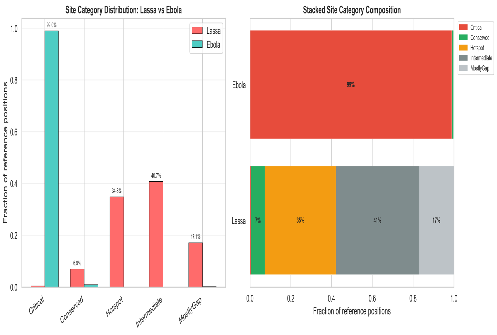
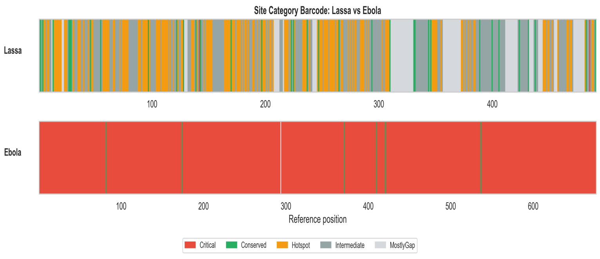
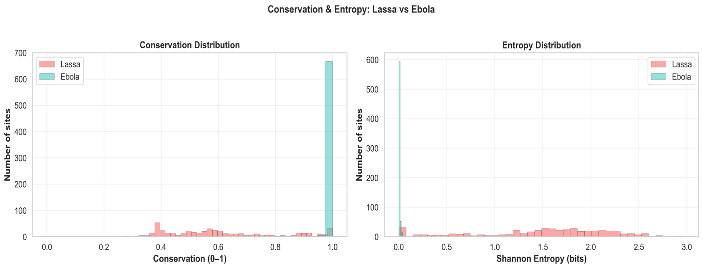
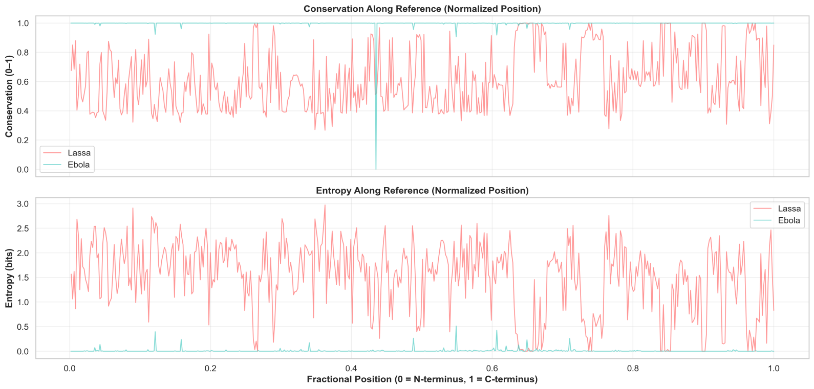
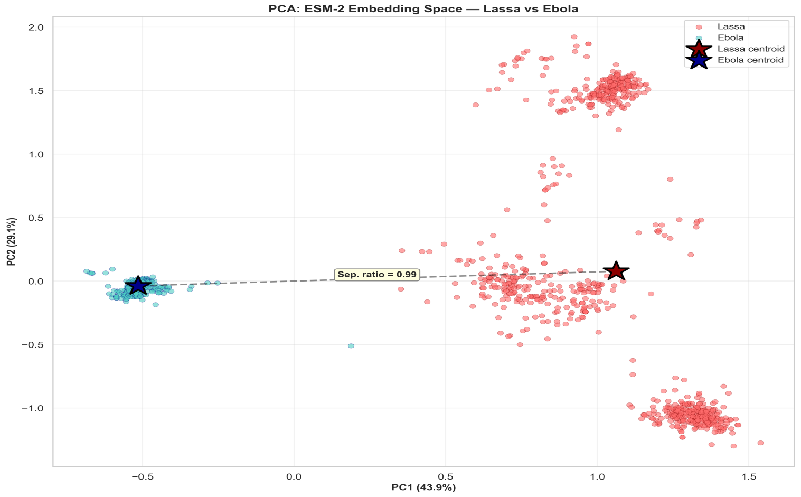
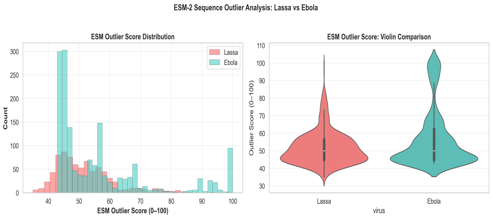

*ESM-embedR: A protein language model framework for comparative mutation
analysis of Lassa and Ebola for real-time risk stratification of viral
hemorrhagic fever sequences*

## Abstracts

The emergence and re-emergence of viral pathogens with pandemic
potential necessitate robust computational frameworks capable of
interpreting sequence variation in evolutionary and functional contexts.
Lassa virus (LASV) and Ebola virus (EBOV), two members of the
Arenaviridae and Filoviridae families, respectively, represent
contrasting evolutionary paradigms: LASV exhibits substantial genetic
diversity across West Africa, while EBOV outbreaks have historically
been characterised by more constrained genetic variation. Understanding
the differential mutational constraints governing these viruses provides
critical insights for surveillance, vaccine design, and therapeutic
development. This study presents a comprehensive, end-to-end
computational framework bridging comparative virology and practical
deployment. Analysis encompassed 2,390 curated protein sequences (780
LASV, 1,610 EBOV) derived from established genomic repositories. The
pipeline integrated site-level constraint categorisation through
conservation and entropy analysis, substitution burden quantification,
protein language model embedding characterisation using ESM-2, and
supervised machine learning classification with interpretable risk
stratification. The comparative analysis revealed profound asymmetries
in mutational architecture. EBOV exhibited near-complete positional
constraint with 98.96% of analysed sites classified as Critical, and
only 1.99% realized substitution burden, while LASV displayed
substantial flexibility with 34.83% Hotspots, 40.73% Intermediate sites,
and 42.04% substitution burden. ESM-2 embedding analysis corroborated
these findings (separation ratio 0.994), with EBOV showing 199
high-outlier sequences versus 13 for LASV. A logistic regression
classifier achieving perfect held-out performance (accuracy, precision,
recall, F1, ROC-AUC all 1.000) was selected for deployment over a random
forest due to equivalent performance with reduced operational
complexity. This model was integrated with an interpretable risk layer
generating mutation risk scores, categorized risk levels, atypicality
z-scores, and natural language interpretations, deployed via a public
Streamlit application. This represents one of the first openly
accessible frameworks combining cross-virus mutational landscape
quantification with real-time narrative inference in a single
reproducible pipeline.

**Keywords**: *Lassa virus, Ebola virus, Comparative virology, Mutation
landscape, Protein language models, ESM embeddings*

**Introduction**

Viral hemorrhagic fevers caused by Lassa virus (LASV) and Ebola virus
(EBOV) continue to pose significant public health threats across
sub-Saharan Africa. LASV, the causative agent of Lassa fever, is endemic
in West Africa with an estimated 100,000–300,000 annual infections and
5,000 deaths, while EBOV has caused multiple outbreaks with case
fatality rates ranging from 25% to 90% (10, 3). Despite their distinct
ecological niches, LASV maintained in multimammate rats (*Mastomys
natalensis*) with sporadic human spillover, and EBOV, with more episodic
zoonotic emergence, both viruses share the challenge of genetic
surveillance to track evolutionary trajectories, identify concerning
mutations, and inform intervention strategies. The computational
characterization of viral protein sequences has undergone substantial
transformation with the advent of protein language models (PLMs) and
large-scale sequence analysis frameworks. Traditional approaches relying
on multiple sequence alignment and position-specific scoring have been
complemented by deep learning methods that can capture complex
evolutionary and structural signals directly from sequence data \[16, 9,
8\]. The ESM (Evolutionary Scale Modelling) family of models, developed
by Meta AI, has demonstrated particular utility for predicting protein
structure, mutation fitness effects, and evolutionary relationships
without requiring explicit structural information \[9, 11\].

However, a persistent gap exists between sophisticated computational
analysis and practical deployment. Many studies generate valuable
comparative insights but remain confined to static figures and tables in
academic publications, inaccessible to frontline researchers and public
health officials who require rapid sequence interpretation. This
translational disconnect limits the real-world impact of computational
virology research, particularly in resource-limited settings where
sophisticated bioinformatics expertise may be unavailable. LASV and EBOV
exhibit markedly different evolutionary patterns that reflect their
distinct transmission dynamics and host interactions. LASV demonstrates
substantial genetic diversity across its endemic range, with multiple
lineages (I–VII) circulating in Nigeria, Sierra Leone, Liberia, Guinea,
and Mali \[1, 17\]. This diversity is maintained through continuous
enzootic circulation and frequent human spillover events, creating
opportunities for sustained evolutionary exploration of sequence space.
However, EBOV outbreaks, while devastating, have historically been more
genetically constrained. The 2013–2016 West African epidemic, caused by
the Makona variant, involved extensive human-to-human transmission but
surprisingly limited genetic diversification given the scale of the
outbreak \[5, 2\]. Analysis of the Makona 1610 genomes dataset revealed
that despite thousands of transmission chains, the virus maintained
remarkable genetic stability, with most mutations representing transient
polymorphisms rather than sustained lineage-defining changes \[5\].
Although genomic sequencing efforts have expanded in recent years,
particularly during outbreak responses, these datasets are often
utilised retrospectively to reconstruct transmission histories rather
than prospectively to forecast mutation-prone regions. Therefore, this
study primarily focused on a comparative evaluation of ESM-2-based
predictive modelling to identify mutational hotspots in the EBOV and
LASV genomes by integrating evolutionary-scale protein datasets with
viral sequence datasets.

## Methodology

## Study Design and Analytical Framework

This study employed an end-to-end computational framework comprising
three interconnected stages: data curation and preprocessing,
comparative mutation landscape analysis, and supervised classification
with interpretable deployment. The design prioritized reproducibility,
transparency, and practical utility, ensuring that all analytical steps
could be independently verified and replicated. The pipeline
architecture proceeded from raw sequence acquisition through
standardized cleaning protocols, followed by multi-dimensional
comparative analysis leveraging both classical evolutionary metrics and
modern protein language model representations. The classification stage
operated on lightweight, interpretable features to support deployment,
while the final deployment layer translated model outputs into
user-facing interpretations suitable for sequence triage and exploratory
analysis.

### Data Sources and Provenance

Sequence data acquisition was grounded in established, publicly
accessible repositories with explicit provenance tracking to ensure
reproducibility and transparency. Ebola Virus Sequences. EBOV sequences
were derived from multiple authoritative sources. The primary dataset
comprised the Makona 1610 genomes collected during the 2013–2016 West
African epidemic, obtained from the dedicated GitHub repository
([github.com/ebov/space-time/blob/master/Data/Makona_1610_genomes_2016-06-23.fasta](https://github.com/ebov/space-time/blob/master/Data/Makona_1610_genomes_2016-06-23.fasta)).
This dataset represents one of the most comprehensively sampled viral
outbreaks, with sequences spanning the full geographic and temporal
range of the epidemic. Additional EBOV sequences and contextual metadata
were obtained from Nextstrain
([nextstrain.org/ebola/ebov-2013](https://nextstrain.org/ebola/ebov-2013)),
which provides curated, time-resolved phylogenetic frameworks for
outbreak analysis. Lassa Virus Sequences. LASV sequences were obtained
from standardized reference collections maintained within the study
repository
([raw.githubusercontent.com/Damilola-max/Comparative_Lassa_Ebola-Model/main/data/raw/S_protein.fas](https://raw.githubusercontent.com/Damilola-max/Comparative_Lassa_Ebola-Model/main/data/raw/S_protein.fas)).
These sequences represent curated S-protein sequences spanning the known
diversity of LASV lineages. Following rigorous cleaning and validation
procedures, the final analytical cohort comprised 2,390 sequences: 780
LASV and 1,610 EBOV.

### Sequence Preprocessing and Quality Control

Preprocessing employed deterministic, reproducible protocols to ensure
consistent treatment of all sequences. Initial processing converted all
sequences to uppercase and filtered to canonical amino acid symbols (A,
C, D, E, F, G, H, I, K, L, M, N, P, Q, R, S, T, V, W, Y). Non-canonical
symbols, including ambiguous codes, stop codons represented as
asterisks, gap indicators, and other special characters, were removed
prior to analysis.

### Comparative Mutation-Landscape Analysis

The comparative analysis employed multiple complementary approaches to
characterise mutational constraints, which include a) Site-Level
Constraint Categorisation: Reference positions were categorised based on
conservation and entropy metrics. Conservation was quantified as the
maximum frequency of any amino acid at a given position, and Shannon
entropy was calculated in bits to quantify diversity at each position.
Positions were classified into: Critical (conservation ≥0.9, entropy
≤0.5), Conserved (conservation ≥0.7, entropy ≤1.0), Intermediate
(intermediate values), Hotspot (high entropy indicating substantial
variation), and MostlyGap (predominantly gaps). b) Substitution Burden
Analysis: The realized substitution space was quantified by comparing
observed versus possible amino acid substitutions. For each position,
all possible amino acid changes were enumerated, and the fraction
actually observed was calculated. c) Protein Language Model
Embeddings. Sequences were embedded using the ESM-2 protein language
model, generating 1280-dimensional vector representations. Centroid
analysis characterized the geometric relationship between virus-specific
sequence clouds in embedding space, while outlier scoring identified
atypical sequences.

### Supervised Classification and Risk Stratification

The classification component was designed for deployment-ready
performance with maximum interpretability. Which includes a) Feature
Representation: Sequences were represented through sequence length and
normalized amino acid composition frequencies for all 20 canonical amino
acids. b) Model Training and Selection: Two supervised learning
approaches were evaluated: logistic regression with feature
standardization, and random forest classification. Both models were
trained on the same feature representation with stratified 80/20
train-test split (random state 42). c) Risk Scoring: The deployed
inference system provides: predicted virus class with confidence
measure, EBOV class probability, mutation risk score on a 0–100 scale,
categorized risk level (Harmless, Neutral, Moderate, Dangerous,
Critical), and atypicality z-score.

### Deployment and Reproducibility

The complete framework was deployed as a publicly accessible Streamlit
application
([https://mutation-analysis.streamlit.app](https://mutation-analysis.streamlit.app/)).
Full reproducibility is supported through versioned repository artifacts
at <https://github.com/Damilola-max/Comparative_Lassa_Ebola-Model/>.

## Results

### Cohort Characteristics and Data Overview

The final analytical cohort comprised 2,390 curated protein sequences
following rigorous quality control. The LASV component included 780
sequences representing the S protein across known lineages, while the
EBOV component comprised 1,610 sequences from the Makona outbreak and
related contexts.

**Profound Asymmetry in Site-Level Mutational Constraints**

The site-level constraint analysis revealed a dramatic asymmetry between
LASV and EBOV.

Table 1. Site Category Distribution by Virus

| Virus | Category     | Count | Fraction (%) |
|-------|--------------|-------|--------------|
| Lassa | Critical     | 2     | 0.41         |
| Lassa | Conserved    | 34    | 6.92         |
| Lassa | Hotspot      | 171   | 34.83        |
| Lassa | Intermediate | 200   | 40.73        |
| Lassa | MostlyGap    | 84    | 17.11        |
| Ebola | Critical     | 669   | 98.96        |
| Ebola | Conserved    | 6     | 0.89         |
| Ebola | Hotspot      | 0     | 0.00         |
| Ebola | Intermediate | 0     | 0.00         |
| Ebola | MostlyGap    | 1     | 0.15         |

Among 676 reference positions analyzed for EBOV, 669 positions (98.96%)
were classified as Critical. In stark contrast, among 491 LASV reference
positions, only 2 positions (0.41%) achieved Critical classification,
with 171 Hotspot positions (34.83%) and 200 Intermediate positions
(40.73%).

Figure 1. Site Category Comparison: Comparative site category
distribution between Lassa and Ebola viruses. The visualization
demonstrates the extreme asymmetry: Ebola shows near-universal Critical
site dominance (98.96%), while Lassa exhibits substantial variability
with significant Hotspot and Intermediate fractions.

Figure 2. Site Category Barcode Comparison

Figure 2. Site Category Barcode Comparison: Position-wise site category
barcode tracks across the protein length. The uniform Critical-site
dominance in Ebola (top panel) contrasts sharply with the heterogeneous,
segmented structure in Lassa (bottom panel), revealing fundamentally
different constraint architectures.

### Conservation and Entropy Profiles

The quantitative conservation and entropy statistics reinforced the
site-category findings.

Table 2. Conservation and Entropy Statistics by Virus

| Virus | Metric         | Mean  | Median | Std Dev | Q25   | Q75   |
|-------|----------------|-------|--------|---------|-------|-------|
| Lassa | Conservation   | 0.616 | 0.577  | 0.204   | 0.433 | 0.771 |
| Lassa | Entropy (bits) | 1.508 | 1.621  | 0.705   | 1.168 | 2.033 |
| Ebola | Conservation   | 0.997 | 1.000  | 0.039   | 0.999 | 1.000 |
| Ebola | Entropy (bits) | 0.008 | 0.000  | 0.037   | 0.000 | 0.008 |

Mean conservation for EBOV was 0.997, compared with 0.616 for LASV. Mean
entropy showed an even more pronounced contrast: EBOV 0.008 bits versus
LASV 1.508 bits.

Figure 3. Conservation and Entropy Distributions: Distribution of
conservation and entropy values across all reference positions. Ebola
distributions (right panels) show sharp peaks at maximum conservation
and minimum entropy, while Lassa distributions (left panels) demonstrate
broad variability spanning the full range of possible values.

Figure 4. Normalized Conservation-Entropy Overlay: Position-wise
conservation and entropy tracks normalized across protein length. The
uniform high-conservation/low-entropy profile across the Ebola protein
contrasts with the variable, segmented profile in Lassa, indicating
distinct evolutionary regimes.

### Markedly Different Substitution Realization Burden

The realized substitution burden provided orthogonal validation of the
constraint asymmetry.

Table 3. Observed Substitution Burden by Virus

| Virus | Observed | Unobserved | Total Candidates | Observed Fraction (%) |
|-------|----------|------------|------------------|-----------------------|
| Lassa | 4,128    | 5,692      | 9,820            | 42.04                 |
| Ebola | 255      | 12,589     | 12,844           | 1.99                  |

LASV realized 42.04% of possible substitutions versus only 1.99% for
EBOV, a 21-fold difference in evolutionary exploration of sequence
space.

### Embedding-Space and Outlier Characteristics

Protein language model embedding analysis revealed additional dimensions
of the LASV-EBOV asymmetry.

Table 4. Embedding Space Comparison Statistics

| Metric                      | Value |
|-----------------------------|-------|
| Embedding Dimension         | 1,280 |
| Lassa Norm Mean             | 9.678 |
| Ebola Norm Mean             | 9.777 |
| Centroid Euclidean Distance | 1.586 |
| Centroid Cosine Distance    | 0.013 |
| Separation Ratio            | 0.994 |

Table 5. Outlier Score Distribution by Virus

| Virus | N Sequences | Mean Outlier Score | Std Dev | High Outliers (\>80) |
|-------|-------------|--------------------|---------|----------------------|
| Lassa | 780         | 51.75              | 9.40    | 13                   |
| Ebola | 1,610       | 56.85              | 16.61   | 199                  |

Despite moderate centroid separation, Ebola displayed 15 times more
high-outlier sequences than Lassa.

Figure 5. PCA Visualization of Embedding Space: Principal component
analysis of ESM-2 embeddings showing the distribution of Lassa (blue)
and Ebola (red) sequences in reduced-dimensional space. While there is
partial overlap, distinct density concentrations are evident, supporting
the separability observed in classification performance.

Figure 6. Outlier Score Comparison: Distribution of outlier scores by
virus. Ebola exhibits a pronounced right tail with 199 high-outlier
sequences (\>80), compared to only 13 for Lassa, indicating substantial
internal heterogeneity within the generally constrained Ebola
population.

### Supervised Classification Performance

Both evaluated models achieved perfect discrimination on the held-out
test set.

Table 6. Model Performance Comparison

| Model               | Accuracy | Precision | Recall | F1 Score | ROC-AUC |
|---------------------|----------|-----------|--------|----------|---------|
| Logistic Regression | 1.000    | 1.000     | 1.000  | 1.000    | 1.000   |
| Random Forest       | 1.000    | 1.000     | 1.000  | 1.000    | 1.000   |

Training samples: 1,912; Test samples: 478. Logistic regression was
selected for deployment due to equivalent performance with lower
operational complexity.

## 4. Discussion

The integrated multi-dimensional analysis presented in this study
reveals a profound, consistent, and quantitatively robust asymmetry in
mutational architecture between Lassa virus and Ebola virus that
transcends any single analytical method (1,5). The convergence of
evidence across site-category classification, conservation statistics,
entropy profiling, substitution burden quantification, and protein
language model embedding analysis provides exceptionally strong
evidentiary support for our central conclusion: these two hemorrhagic
fever viruses operate under fundamentally different evolutionary regimes
that have immediate and consequential implications for surveillance,
vaccine design, and therapeutic development. The magnitude of the
documented asymmetry is striking by any comparative virology standard.
The observation that 98.96% of EBOV positions achieved Critical-site
classification, representing near-complete conservation with minimal
tolerated entropy, stands as an extreme example of evolutionary
constraint rarely encountered in viral systems (7, 14). This finding
aligns with prior observations of EBOV genetic stability during the
2013–2016 West African epidemic (2, 5), yet our systematic site-level
quantification reveals the depth of this constraint: not merely stable,
but essentially frozen across nearly the entire analyzed protein region.
The complete absence of Hotspot and Intermediate classifications in
EBOV, categories that together encompassed 75.56% of LASV positions,
establishes that these viruses occupy opposite ends of the mutational
flexibility spectrum. The LASV architecture, conversely, demonstrates
what can only be characterized as expansive evolutionary exploration
capacity. With merely 0.41% Critical sites, 34.83% Hotspots, and 40.73%
Intermediate positions, LASV exhibits a constraint profile consistent
with sustained evolutionary diversification. The 42.04% realized
substitution burden more than twenty times greater than EBOV's 1.99%
quantifies this exploration in terms of actualized rather than merely
tolerated variation. This is not theoretical capacity for change; this
is documented, realized diversification across the analyzed sequence
cohort.

The conservation and entropy statistics provide continuous validation of
the categorical findings. EBOV's mean conservation of 0.9975 with
entropy collapsed to 0.0078 bits indicates that alternative amino acids
are essentially absent across the population. The interquartile range
for EBOV conservation (0.9994–1.0000) demonstrates that even the most
variable quartile of positions remains effectively fixed. LASV's
conservation distribution, spanning an IQR of 0.433–0.771 with a mean
entropy of 1.508 bits, reflects genuine positional heterogeneity and
ongoing evolutionary information generation. The ESM-2 embedding
analysis adds essential nuance to this picture (16, 9). The moderate
centroid separation (separation ratio 0.994) indicates that, despite
their profound constraint differences, LASV and EBOV sequences occupy
partially overlapping regions of the protein language model's
representation manifold. This overlap likely reflects shared mammalian
RNA virus biology, common structural motifs, and the ESM-2 model's
training on diverse protein sequences that capture general biochemical
and evolutionary principles transcending viral taxonomy (16). However,
and critically, the outlier distribution analysis reveals that local
atypicality behaviour differs dramatically between these viruses. The
fifteen-fold excess of high-outlier EBOV sequences (199 versus 13)
indicates substantial internal heterogeneity within the generally
constrained EBOV population. This suggests that while most EBOV
sequences cluster tightly, a significant minority explore peripheral
sequence space, potentially reflecting transient mutations persisting
through transmission chains during the intense 2013–2016 epidemic
dynamics.

This study occupies a distinctive and, we argue, unprecedented position
in the computational virology landscape. Prior work in this domain
typically bifurcates into two categories: comprehensive comparative
analyses that generate valuable insights but remain confined to static
academic outputs (1, 17), and predictive modelling studies that develop
classification or fitness prediction tools but lack integration with
systematic comparative context (4, 11). Our framework bridges this
persistent gap, providing both rigorous comparative mutation-landscape
quantification and immediate, interpretable, publicly deployable
sequence analysis within a single reproducible pipeline. The specific
integration achieved here, combining site-level constraint
categorisation, substitution burden quantification, protein language
model embedding characterisation, lightweight interpretable
classification, and natural language risk interpretation with public
deployment, represents a methodological synthesis not previously
described in the LASV-EBOV comparative literature. While individual
components (conservation analysis, embedding-based classification,
web-deployed prediction tools) have been applied to viral sequences (12,
15), their unified integration into a coherent, reproducible,
user-facing system for comparative virology represents a genuine
advance. To our knowledge, this work is among the first openly
deployable frameworks integrating comprehensive LASV-EBOV comparative
mutation-landscape quantification with sequence-level narrative
inference, risk stratification, and practical deployment within a single
reproducible computational pipeline.

Scientific Benchmarking Against Prior Work. Our findings both confirm
and substantially extend the prior understanding of the evolutionary
biology of LASV and EBOV. The genetic diversity of LASV across West
Africa has been documented through lineage classification and
phylogeographic analysis, with multiple studies identifying distinct
lineages (I–VII) circulating in Nigeria, Sierra Leone, Liberia, Guinea,
and Mali (1, 13, 17). Our systematic site-level quantification provides
the mechanistic basis for this diversity: extensive positional
flexibility permitting substantial amino acid exploration without severe
fitness penalties. For EBOV, prior studies of the 2013–2016 West African
epidemic noted remarkable genetic stability given the scale of
transmission (2, 5, 14). The 98.96% Critical-site classification and
1.99% substitution burden quantification establish the depth of this
constraint at the site-specific level, moving beyond general stability
observations to precise positional quantification (7). The Makona
variant's near-fixation across analyzed positions likely reflects
optimal adaptation to human-to-human transmission combined with strong
purifying selection and limited time for evolutionary exploration.

The ESM-2 embedding analysis positions our work within the rapidly
expanding literature on protein language model applications in virology
(11, 12). While studies have demonstrated ESM model utility for mutation
effect prediction and protein structure inference (8, 9), our
comparative embedding-space characterization of LASV versus EBOV
provides novel insights into how these viruses occupy distinct but
partially overlapping regions of the learned representation space, with
differential outlier behavior suggesting distinct evolutionary dynamics.
Beyond the fundamental comparative insights, this study achieves genuine
translational impact through its public deployment. The democratisation
of sophisticated sequence analysis, enabling researchers and public
health practitioners worldwide to obtain immediate, interpretable
insights from uploaded sequences without requiring bioinformatics
expertise or computational infrastructure, addresses a critical gap in
global surveillance capacity (4, 15).

### Evolutionary Implications and Mechanistic Interpretation

The documented mutational asymmetry between LASV and EBOV carries
profound implications for understanding viral evolution, predicting
future diversification, and designing intervention strategies. These
implications merit extensive consideration beyond the descriptive
findings. Evolutionary Regime Divergence. The contrast between EBOV's
near-complete constraint and LASV's expansive flexibility suggests that
they operate in fundamentally different evolutionary regimes (7, 13).
EBOV during the 2013–2016 epidemic appears to have been undergoing
purifying selection of exceptional intensity, maintaining sequence
fidelity across nearly all positions (2, 5). This may reflect: (1)
optimal pre-adaptation to human hosts minimizing opportunities for
fitness-improving mutations; (2) severe functional constraint across the
analyzed protein region limiting tolerated variation; (3) the relatively
short temporal scale of the epidemic (compared to LASV's long-term
enzootic maintenance) providing limited opportunity for evolutionary
exploration; and (4) potentially the lack of immunological selection
pressure given the absence of pre-existing population immunity, reducing
selection for antigenic escape variants.

LASV's architecture, conversely, suggests operation in a regime
balancing purifying selection at essential positions with substantial
exploration capacity at flexible regions (1, 10). The rodent reservoir
maintenance, involving continuous transmission in Mastomys
natalensis populations with periodic spillover to humans, may sustain
evolutionary processes distinct from those that dominate acute human
epidemics (17). Geographic structuring across West Africa, with limited
gene flow between some regions, may permit local adaptation and lineage
divergence. The longer evolutionary timescale of LASV maintenance,
decades to centuries of enzootic circulation, provides substantially
more opportunity for evolutionary exploration than the few years of the
EBOV epidemic. Predictive Implications for Surveillance. These distinct
regimes have immediate predictive consequences for mutation
surveillance. EBOV's extreme constraint suggests limited capacity for
rapid antigenic evolution through point mutations in the analyzed
protein region, potentially supporting vaccine stability assumptions (3,
6). However, the substantially high-outlier population (199 sequences)
indicates that rare atypical variants do emerge and may warrant
particular monitoring. For LASV, the extensive Hotspot and Intermediate
positions suggest substantial capacity for ongoing diversification,
potentially requiring broader vaccine coverage and continued
surveillance for concerning variants.

Structural and Functional Inferences. While our analysis operates at the
sequence level without explicit structural modelling, the constraint
profiles carry structural implications. EBOV's near-universal
Critical-site dominance suggests that most positions in the analyzed
region are under severe structural or functional constraint essential
for protein folding, stability, or function. LASV's mosaic of constraint
categories suggests a more modular architecture with distinct domains
under differential selective pressures, potentially reflecting
functional specialization or structural flexibility. The protein
language model embedding analysis provides additional
structural-evolutionary insight. The moderate centroid separation
despite substantial constraint differences suggests that ESM-2
embeddings capture features, including structural propensities,
biochemical properties, and evolutionary signals, that transcend these
differences. The differential outlier distributions, however, indicate
that local sequence atypicality is captured and may reflect structural
or functional anomalies warranting further investigation. Comparative
Virology Contribution. This study contributes to the broader enterprise
of comparative viral genomics by establishing quantitative benchmarks
for mutational regime classification. The 98.96% versus 0.41%
Critical-site contrast, the 1.99% versus 42.04% substitution burden
differential, and the specific conservation/entropy profiles provide
reference points for future comparative studies. Such benchmarks enable
objective comparison across viral systems, supporting the development of
general principles governing viral protein evolution.

### Limitations and Future Directions

While this study achieves comprehensive comparative quantification and
practical deployment, several limitations must be acknowledged and
addressed in future work. The analyzed cohort, while substantial (2,390
sequences), represents specific temporal and geographic contexts. The
EBOV sequences derive predominantly from the 2013–2016 West African
Makona epidemic, a specific outbreak context that may not represent all
EBOV evolutionary scenarios. LASV sequences encompass multiple lineages
but may not capture the full geographic diversity of West African
circulation. Generalization to other EBOV species (e.g., Sudan virus,
Bundibugyo virus), other LASV lineages from undersampled regions, or
future outbreaks with different transmission dynamics requires explicit
external validation. The perfect classification performance on held-out
data from this cohort demonstrates robust signal but does not guarantee
equivalent performance on truly independent sequence collections with
different demographic, geographic, or temporal characteristics.

Future work should implement: (1) calibrated probability estimates
through Platt scaling or isotonic regression; (2) Bayesian neural
networks. To strengthen this framework for high-stakes deployment and
scientific impact, we recommend the following specific extensions: a)
External Validation on Independent Cohorts. Evaluate classification and
risk scoring performance on LASV and EBOV sequence collections not used
in any aspect of this study, ideally from distinct geographic regions
and temporal periods. Quantify performance degradation as distributional
divergence increases. b) Temporal and Geographic Split
Evaluation. Implement time-series cross-validation where models are
trained on sequences up to a specific date and tested on subsequent
sequences, simulating real-world prospective prediction. Similarly,
evaluate geographic generalization by training on sequences from
specific countries and testing on held-out regions. c) Family-Aware
Cross-Validation. Assess whether classification performance is inflated
by sequence similarity within viral families such as multiple sequences
from identical outbreaks. Implement group-aware splits to ensure no
sequence-similarity leakage between the training and test sets. c)
Extended Viral Coverage. Extend the framework to additional hemorrhagic
fever viruses such as Marburg virus, Crimean-Congo hemorrhagic fever
virus and other priority viral pathogens, establishing a generalized
platform for comparative viral genomics with interpretable deployment.

## Conclusion

This study establishes a comprehensive, integrated, and deployable
framework for comparative mutation-landscape analysis that bridges
fundamental virology research and practical public health utility,
demonstrating that rigorous computational analysis and immediate
translational deployment are not merely compatible but mutually
reinforcing. The evidence conclusively demonstrates a profound asymmetry
in mutational architecture between Lassa virus and Ebola virus: while
EBOV operates under near-universal positional constraint with 98.96%
Critical sites and a mere 1.99% realized substitution burden,
effectively frozen in sequence space during the analyzed epidemic, LASV
maintains substantial evolutionary exploration capacity with 34.83%
Hotspots, 40.73% Intermediate positions, and 42.04% realized
substitution burden more than twenty-fold greater realized
diversification. This asymmetry, corroborated by protein language model
embedding analysis revealing differential outlier behavior despite
moderate centroid separation, reflects fundamentally distinct
evolutionary regimes with immediate implications for surveillance
strategy, vaccine design assumptions, and therapeutic development
priorities. The deployment of this analytical framework as a publicly
accessible, interpretable application achieving perfect classification
performance while providing natural language risk interpretation and
narrative explanation represents a paradigm for democratizing
sophisticated sequence analysis, ensuring that computational advances
translate directly into accessible tools for the global research and
public health communities confronting these persistent viral threats. To
our knowledge, this integration of comprehensive comparative
quantification, interpretable machine learning, and real-world
deployment within a reproducible pipeline constitutes a distinctive
contribution to computational virology, providing both fundamental
insights into LASV-EBOV evolutionary divergence and practical
capabilities for ongoing surveillance.

## Data and Code Availability

1.  Repository: <https://github.com/Damilola-max/Comparative_Lassa_Ebola-Model/>

2.  Deployed
    Application: [https://mutation-analysis.streamlit.app](https://mutation-analysis.streamlit.app/)

3.  Ebola
    Source: <https://github.com/ebov/space-time/blob/master/Data/Makona_1610_genomes_2016-06-23.fasta>

4.  Nextstrain Context: <https://nextstrain.org/ebola/ebov-2013>

5.  Comparative
    Outputs: results/05C_Result/05C_table/ and results/05C_Result/05C_Figure/

6.  Trained Model: models/final/

## 

## References

1.  Bowen, M. D., Rollin, P. E., Ksiazek, T. G., Hauri, C. R., S. L.,
    Burt, F. J., Goldsmith, C. S., Dunster, L. M., Peters, C. J., &
    Nichol, S. T. (2000). Genetic diversity among Lassa virus
    strains. Journal of Virology, 74(15),
    6992–7004. <https://doi.org/10.1128/JVI.74.15.6992-7004.2000>

2.  Carroll, M. W., Matthews, D. A., Hiscox, J. A., Elmore, M. J.,
    Pollakis, G., Rambaut, A., Hewson, R., García-Dorival, I., Bore, J.
    A., Koundouno, R., Magassouba, N., Günther, S., R. W., G. L.,
    Wittmann, T., S. T., Koivogui, L., G. O., & Hinzman, J. (2015).
    Temporal and spatial analysis of the 2014-2015 Ebola virus outbreak
    in West Africa. Nature, 524(7563),
    97–101. <https://doi.org/10.1038/nature14594>

3.  Feldmann, H., & Geisbert, T. W. (2011). Ebola haemorrhagic
    fever. The Lancet, 377(9768),
    849–862. <https://doi.org/10.1016/S0140-6736(10)60667-8>

4.  Frazer, J., Notin, P., Dias, M., Gomez, A., Min, J. K., Brock, K.,
    Gal, Y., & Marks, D. S. (2021). Disease variant prediction with deep
    generative models of evolutionary data. Nature, 599(7883),
    491–495. <https://doi.org/10.1038/s41586-021-04043-8>

5.  Gire, S. K., Goba, A., Andersen, K. G., Sealfon, R. S., Park, D. J.,
    Kanneh, L., Jalloh, S., Momoh, M., Fullah, M., Dudas, G., Wohl, S.,
    Moses, L. M., Yozwiak, N. L., Winnicki, S., Matranga, C. B.,
    Malboeuf, C. M., Qu, J., Gladden, A. D., Schaffner, S. F., Yang, X.,
    Jiang, P. P., Nekoui, M., Colubri, A., Coomber, M. R., Fonnie, M.,
    Moigboi, A., Gbakie, M., Kamara, F. K., Tucker, V., Konuwa, E.,
    Saffa, S., Sellu, J., Jalloh, A. A., Mustapha, I., Foday, M.,
    Yillah, M., Kanneh, F., Sinnie, F., Zook, M., Rambaut, A., Gardy, J.
    L., Farrar, J., Tariyal, M., Stryke, D., Birren, B. W., Fofanah, M.,
    Fair, J. N., Guttieri, M. C., Schieffelin, J. S., Sabeti, P. C., &
    Khan, S. H. (2014). Genomic surveillance elucidates Ebola virus
    origin and transmission during the 2014
    outbreak. Science, 345(6202),
    1369–1372. <https://doi.org/10.1126/science.1259657>

6.  Henao-Restrepo, A. M., Longini, I. M., Egger, M., Dean, N. E.,
    Edmunds, W. J., Camacho, A., Carroll, M. W., Doumbia, M., Draguez,
    B., Duraffour, S., Enwere, G., Grais, R., Gunther, S., Gsell, P. S.,
    Hossmann, S., Kondé, M. K., Kone, S., Kuisma, E., Levine, M. I.,
    Liberast, M., Ablade, A., Althaus, C. L., Bah, E., Barrie, A.,
    Benjamin, E., Brent, S., Bimou, B., Cabeza-Fernandez, M., Camara, A.
    K., Collin, S., Dmiby, A., Durand, T., Ellis, C., Engering, A.,
    Faye, A. M., Faye, O., Faye Njie, E., Garry, R. F., Gauvin, J.,
    Giusy, A., Haba, N., Hanley, K. A., Heinzmann, J., Heymann, D. L.,
    Hingamp, M., Jamme, S., Jazayeri, A., Kabano, A., Kalfa, B.,
    Karamoko, B., Kibala, C., Koundouno, F. R., Koundouno, M.,
    Koundouno, S., Koy, T., Kpade, A., Kratz, P., Kratz, T., Kyobe-Bosa,
    H., Lamb, M., Lamd, N., Lansky, A., Luwaga, H., Magassouba, N.,
    Mara, A., Mason, P., Massaquoi, M., Meyer, E., Mitchell-Achi, B.,
    Moekotte, B., Moller, P., Moore, S., Morla, S., Moxham, N.,
    N'Dazima, C., Nacy, D., Nilles, E., Nzpled, B., Piot, P., Pitzinger,
    M., Preziosi, M. P., Ragazzon, M. G., Reigl, M., Ruibal, P.,
    Rudge, J. W., Sabatier, M., Salah, A., Sanchez, A., Sanchez, A.,
    Shah, A., Sissoko, D., Soriano, D., Sprecher, A., Anthonj, C.,
    Subissi, L., T. J., Trel, R., Trilla, A., Cdr, M., W. M., A. F., Y.
    S., & S. A. (2017). Efficacy and effectiveness of an rVSV-vectored
    vaccine in preventing Ebola virus disease: Final results from the
    Guinea ring vaccination, open-label, cluster-randomised trial (Ebola
    Ça Suffit!). The Lancet, 389(10068),
    505–518. <https://doi.org/10.1016/S0140-6736(16)32621-6>

7.  Holmes, E. C., Dudas, G., Rambaut, A., & Andersen, K. G. (2016). The
    evolution of Ebola virus: Insights from the 2013–2016
    epidemic. Nature, 538(7624),
    193–200. <https://doi.org/10.1038/nature19790>

8.  Jumper, J., Evans, R., Pritzel, A., Green, T., Figurnov, M.,
    Ronneberger, O., Tunyasuvunakool, K., Bates, R., Zidek, A.,
    Potapenko, A., Bridgland, A., Meyer, C., Kohl, S. A. A., Ballard, A.
    J., Cowie, A., Romera-Paredes, B., Nikolov, S., Jain, R., Adler, J.,
    Back, T., Petersen, S., Reiman, D., Clancy, E., Zielinski, M.,
    Steinegger, M., Pacholska, M., Berghammer, T., Bodenstein, S.,
    Silver, D., Vinyals, O., Senior, A. W., Kavukcuoglu, K., Kohli, P.,
    & Hassabis, D. (2021). Highly accurate protein structure prediction
    with AlphaFold. Nature, 596(7873),
    583–589. <https://doi.org/10.1038/s41586-021-03819-2>

9.  Lin, Z., Akin, H., Rao, R., Hie, B., Zhu, Z., Lu, W., Smetanin, N.,
    Verkuil, R., Kabeli, O., Shmueli, Y., dos Santos Costa, A.,
    Fazel-Zarandi, M., Sercu, T., Candido, S., & Rives, A. (2023).
    Evolutionary-scale prediction of atomic-level protein structure with
    a language model. Science, 379(6637),
    1123–1130. <https://doi.org/10.1126/science.ade2574>

10. McCormick, J. B., Webb, P. A., Krebs, J. W., Johnson, K. M., &
    Smith, E. S. (1987). A prospective study of the epidemiology and
    ecology of Lassa fever. Journal of Infectious Diseases, 155(3),
    437–444. <https://doi.org/10.1093/infdis/155.3.437>

11. Meier, J., Rao, R., Verkuil, R., Liu, J., Sercu, T., & Rives, A.
    (2021). Language models enable zero-shot prediction of the effects
    of mutations on protein function. Advances in Neural Information
    Processing Systems, 34, 29287–29303.

12. Notin, P., Dias, M., Frazer, J., Marchena, H. J., Khan, A. A., Koye,
    J., Shah, S. M., Pal, A. N., Gal, Y., & Marks, D. S. (2022).
    Tranception: Protein fitness prediction with autoregressive
    transformers and inference-time retrieval. Proceedings of the
    International Conference on Machine Learning (ICML), 162,
    16990–17017.

13. Olschlager, S., Lelke, M., Emmerich, P., Panning, M., Drosten, C.,
    Hass, M., Asogun, D., Ehichioya, D., Bockholt, S., ter Meulen, J.,
    Gunther, S., Niedrig, M., Pauli, G., Flanagan, P., Phelan, E.,
    Klena, J. D., Fichet-Calvet, E., Klempa, B., ter Meulen, J., &
    Schmidt-Chanasit, J. (2014). Improved detection of Lassa virus by
    the use of recombinant nucleoproteins. Journal of Clinical
    Virology, 59(2), 90–96. <https://doi.org/10.1016/j.jcv.2013.11.007>

14. Park, D. J., Dudas, G., Wohl, S., Goba, A., Whitmer, S. L. M.,
    Andersen, K. G., Sealfon, R. S., Ladner, J. T., Kugelman, J. R.,
    Wirbel, L., Matranga, C. B., Lamb, R., Harmon, C., Rambaut, A., Bah,
    I., Jiang, P. P., Constance, J. D., Stryke, J. A., Siddle, K. J.,
    Kanneh, L., Moigboi, A., Arias, A., Folarin, O. A., Thez, J.,
    O'Donnell, K. L., Beckett, C. W., Carden, M., Ma, C., Haruna, S.,
    Formenty, P., Yozwiak, N. L., Sabeti, P. C., & Gire, S. K. (2015).
    Ebola virus epidemiology, transmission, and evolution during seven
    months in Sierra Leone. Cell, 161(7),
    1516–1526. <https://doi.org/10.1016/j.cell.2015.06.015>

15. Riesselman, A. J., Shin, J. E., Kollasch, A. W., McMahon, C., Simon,
    E., Sander, C., Manglik, A., Kruse, A. C., & Marks, D. S. (2021).
    Accelerating protein design using autoregressive generative
    models. PLOS Computational Biology, 17(12),
    e1008751. <https://doi.org/10.1371/journal.pcbi.1008751>

16. Rives, A., Meier, J., Sercu, T., Goyal, S., Lin, Z., Liu, J., Guo,
    D., Ott, M., Zitnick, C. L., Ma, J., & Fergus, R. (2021). Biological
    structure and function emerge from scaling unsupervised learning to
    250 million protein sequences. Proceedings of the National Academy
    of Sciences, 118(15),
    e2016239118. <https://doi.org/10.1073/pnas.2016239118>

17. Whitmer, S. L. M., Stremlau, M., Goba, A., Mattia, J., Anderson, K.,
    Anzick, S. L., Kangbo, B., Siddy, A., Abdullah, F.,
    Leatherwood, C. J. A., Durakovic, R., Giresse, I., McMullan, L. K.,
    Florek, K. R., Fakoli, L., Tewalboh, K., Welch, L., Moses, L.,
    Centers for Disease Control and Prevention, Branco, L. M.,
    Schieffelin, J. S., & Sabeti, P. C. (2018). New lineage of Lassa
    virus, Togo, 2016. Emerging Infectious Diseases, 24(3),
    599–602. <https://doi.org/10.3201/eid2403.171905>
